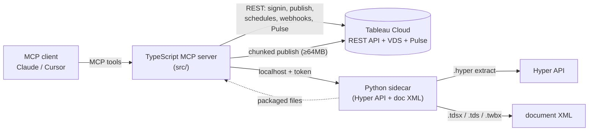

# tableau-mcp-publish

> **Vibe-BI on Tableau Cloud** — from a prompt to governed datasources, branded persona-aware
> dashboards, stories, Pulse metrics, and scheduled refresh. The official `@tableau/mcp-server` lets
> an agent **read and query** Tableau (VizQL Data Service, Metadata API, Pulse). This server lets an
> agent **author and publish** — turn a SQL query, a file, or a live warehouse connection into a
> governed datasource, design and build a branded dashboard from a business question, tell it as a
> Tableau Story, track it as a Pulse metric, and keep it fresh on a schedule. 27 tools, built on the
> Tableau REST API, the Hyper API, and hand-authored Tableau document XML. Drops into the **same MCP
> client config** as the official server.

[](https://github.com/SebAustin/tableau-mcp-publish/actions/workflows/ci.yml)
[](LICENSE)

## Why this exists

Tableau's official MCP server (`tableau/tableau-mcp` v2.18.x) covers reading, querying, and
Desktop-local workbook editing — and adds admin-gated delete/refresh tools in its latest release.
What it still cannot do is build a governed Hyper extract and **publish a datasource or workbook
to Tableau Cloud**, headless, from SQL, a file, or a live connection — let alone design a branded,
audience-aware dashboard from a plain-language question.

That's the half I work with all day as a Tableau Ambassador, so I built the companion. Run them
together and an agent goes from *"query this data"* to *"design an exec dashboard for the CEO
persona, confirm it, publish it, tell it as a story, track the headline number in Pulse, and keep
it refreshed every morning"* — without leaving the conversation.

## Run it alongside the official server

```json
{
  "mcpServers": {
    "tableau": {
      "command": "npx",
      "args": ["-y", "@tableau/mcp-server@latest"],
      "env": {
        "SERVER": "https://my-pod.online.tableau.com",
        "SITE_NAME": "mysite",
        "PAT_NAME": "my_pat",
        "PAT_VALUE": "…"
      }
    },
    "tableau-publish": {
      "command": "npx",
      "args": ["-y", "tableau-mcp-publish@latest"],
      "env": {
        "SERVER": "https://my-pod.online.tableau.com",
        "SITE_NAME": "mysite",
        "PAT_NAME": "my_pat",
        "PAT_VALUE": "…"
      }
    }
  }
}
```

Same env vars. The query server and the publish server share one Personal Access Token.

## Quickstart

```bash
git clone https://github.com/SebAustin/tableau-mcp-publish && cd tableau-mcp-publish
npm install && npm run build
cd sidecar && uv sync && cd ..
cp .env.example .env   # fill SERVER, SITE_NAME, PAT_NAME, PAT_VALUE
npm run dev            # starts the MCP server (stdio) + spawns the Python sidecar
```

Try the bundled demo (needs `DEMO_PROJECT` set to an existing, non-Default project):

```bash
npm run demo -- examples/top_customers.csv
```

It publishes a datasource and a starter workbook from a bundled CSV and prints both Cloud URLs.

## What an agent can do with it

> **"Take the top 100 customers by revenue from Snowflake and publish it as a governed datasource
> called 'Top Customers' in the Sales project, then build a starter workbook with a bar chart of
> revenue by region."**

The agent calls, in sequence:

1. `create_datasource_from_query` — runs the SQL, builds a `.hyper` extract, packages a `.tdsx`,
   publishes to the Sales project → returns the datasource LUID + Cloud URL.
2. `create_starter_workbook` — generates a `.twbx` with a revenue-by-region bar chart bound to
   that datasource, publishes it → returns the workbook URL.

Two tool calls. A governed datasource and a workbook, live on Cloud.

## Prompt-driven authoring — the propose→confirm loop

`design_dashboard` is a **pure planner**: it turns a business question, an audience (or a named
persona), and optional field hints into a `DashboardProposal` — a human-readable summary, a KPI
strip, a list of charts, a layout description, and (when warranted) a `storyOutline`. **It never
publishes anything.** `build_from_plan` is the **only side-effecting tool**: it consumes
`proposal.plan` verbatim, builds a self-contained `.twbx` with the source data embedded (federated
`.hyper` extract), and publishes it to Cloud — plus a governed `.tdsx` datasource as an independent
artifact.

```
design_dashboard  ──▶  DashboardProposal (summary, kpiStrip, views, layoutSummary, storyOutline?)
       │                        │
       │      user: "change X" │      user: "confirm"
       └──── directed mode ◀────┘              │
                                                ▼
                                        build_from_plan(proposal.plan)
                                                │
                                                ▼
                                  published datasource + dashboard workbook (+ story, if any)
```

The split is deliberate and **stateless** — the server holds no conversation state between calls;
the agent re-presents context on every call. The agent can show the proposal to the user, accept
edits via a fresh `directed`-mode call, then build — without re-running an expensive publish on
every refinement.

**End-to-end example — branded executive revenue dashboard:**

> *"From `sales.parquet`, design an exec dashboard for the 'ceo' persona answering 'How is revenue
> trending by region?', show me the proposal, then publish it once I confirm."*

1. `design_dashboard` with `mode="autonomous"`, `persona="ceo"`,
   `businessQuestion="How is revenue trending by region?"`, `fieldHints` from
   `get_datasource_fields` (or `@tableau/mcp-server`), and `datasourceSpec.filePath` set on the
   returned plan → returns a `DashboardProposal` (≤3 sheets, KPI lead, concise CEO tone, branded).
2. Agent relays the proposal's `summary`/`kpiStrip`/`views`/`layoutSummary` to the user.
3. User confirms → `build_from_plan(proposal.plan)` → builds the `.hyper` extract, publishes a
   governed `.tdsx` datasource, applies the CEO persona's brand (palette/typography/number
   formats), and publishes a self-contained, branded `.twbx` workbook →
   `{ workbookLuid, url, datasourceLuid }`.

### Dashboard modes

| Mode | When to use |
|---|---|
| `autonomous` | Supply a business question (+ optional `persona`); the planner derives sheets and layout. |
| `interview` | The planner returns 3–7 clarifying questions; pass answers back as `interview_followup`. |
| `interview_followup` | Answers to interview questions → full proposal. |
| `directed` | Provide explicit sheet directions (e.g. "a bar chart of revenue by region and a trend line"), including revising a prior proposal. |

### Audience

`audience` (or a persona's base audience) shapes sheet count, mark types, density, and canvas size:

| Value | Max sheets | Canvas | Effect |
|---|---|---|---|
| `exec` | 3 | 1000×800 | KPI lead, large text, minimal axes, filled-map allowed (no bare scatter) |
| `analyst` | 8 | 1200×900 | Dense, scatter/map/filled-map allowed, full axes |
| `operational` | 6 | 800×1200 | Status marks, mobile-friendly single column |
| `mixed` | 6 | 1000×900 | Balanced bar/line, one summary KPI |

## The brand.yaml kit + named personas

[`brand.yaml`](brand.yaml) is the single source of brand truth: categorical/sequential/diverging
color palettes, semantic good/bad/neutral colors for KPI deltas, title/body/BAN (Big Number)
typography, number formats, and named **personas** that `design_dashboard` targets with
`persona: "ceo"` instead of (or alongside) a raw `audience`. Every field is optional — delete a
section, or the whole file, and built-in defaults take over (validate with `validate_brand`).

```yaml
personas:
  ceo:
    base: exec              # underlying audience profile
    maxSheets: 3             # tighter than the exec default
    kpiEmphasis: high        # 4 KPI tiles up front
    preferredArtifact: dashboard
    tone: concise             # trims the proposal summary to the essentials
```

Five personas ship out of the box (`ceo`, `cto`, `slt_manager`, `analyst`, `client`), each with
`maxSheets`, `kpiEmphasis`, `preferredArtifact`, `tone`, and `chartDeny` overrides — add your own
without touching code. `build_from_plan` applies the resolved brand's palette, typography, and
number formats to the generated workbook whenever the plan carries persona/brand provenance.

## Connectivity & automation

| Need | Tool / mechanism | Honest caveat |
|---|---|---|
| Live Snowflake/Presto connection, no extract | `create_live_datasource` | Snowflake key-pair auth is impossible over REST (throws, use Desktop); Presto/Trino is generally Tableau-Bridge-dependent on Cloud. Credentials are embedded at publish time (`<connectionCredentials>`) and never written to the `.tds` file or logged. |
| Recurring Cloud-side refresh | `schedule_refresh` / `list_refresh_schedules` / `delete_refresh_schedule` | Cloud can only **execute** a schedule for a cloud-reachable connection with embedded credentials (e.g. Snowflake). A file-based datasource accepts the schedule-creation call but every run fails without Tableau Bridge — the tool always surfaces this note. |
| Recurring refresh for a **local file** datasource | `npm run refresh:local` + `npm run cron:generate` | Cloud cannot refresh a local-file extract itself (no Bridge). `refresh_local.ts` re-ingests the file and republishes with `overwrite=true`; `generate-cron.ts` emits a ready-to-review crontab line + macOS launchd plist — nothing is installed automatically. |
| Event notifications | `create_webhook` / `list_webhooks` / `delete_webhook` | Requires site-administrator PAT privileges; HTTPS-only destinations enforced client-side before any REST call. |
| Single-metric subscription tracking | `create_pulse_definition` / `list_pulse_definitions` / `create_pulse_metric` / `delete_pulse_definition` | Cloud-only. Code-complete against Tableau's official reference payload shape with VDS pre-flight validation, but **live creation currently returns a 400** — the wire shape is specified-by-example only upstream. Treat as best-effort pending a locked fixture (see [`docs/tool_reference.md`](docs/tool_reference.md#pulse)). |
| Field discovery before planning | `get_datasource_fields` | Real field names/types/aggregations via VizQL Data Service — use instead of guessing column names for `fieldHints`. |

## The design-excellence layer (Few/Tufte rules)

Phase E1 encodes a set of deterministic rules inspired by the Stephen Few / Edward Tufte school of
analytical dashboard design. See [BI_DESIGN.md §9](docs/feature-prompt-authoring/BI_DESIGN.md) for
full source lineage and enforcement status per rule:

- **No-pie default** — part-to-whole questions always resolve to a bar; `"pie"` isn't even a
  representable mark type.
- **KPI tiles always carry context** — a comparison/delta is bound whenever the data offers one,
  never a bare number with no "so what."
- **No gauges** — bullet graphs are the documented alternative (gauge is not a representable mark
  type; bullet graph emission is a tracked future gap, not silently substituted).
- **Data-ink discipline** — no gridline/border/shading/drop-shadow option exists anywhere in the
  plan schema, so the planner cannot emit decoration even by accident.
- **Sequential color for magnitude** — a bar or filled map colored by a quantitative field always
  uses continuous color semantics, never the categorical palette.
- **Top-N discipline** — high-cardinality dimensions carry a named "Top 10 + Other" rationale note.
- **Small-multiples hint** — a color-coded bar answering a cross-dimension comparison question
  gets a documented small-multiples alternative noted in its rationale.

## Tools (27)

Full reference with every parameter, guardrail, and example prompt in
[`docs/tool_reference.md`](docs/tool_reference.md).

**Ingest & datasources**

| Tool | What it does |
|---|---|
| `create_datasource_from_query` | SQL → `.hyper` → `.tdsx` → publish to Cloud |
| `create_datasource_from_table` | CSV / records → `.hyper` → `.tdsx` → publish |
| `create_datasource_from_file` | CSV / JSON / JSONL / Excel / Parquet → `.tdsx` → publish (with numeric/date coercion) |
| `create_live_datasource` | Live Snowflake / Presto connection → `.tds` (no extract) → publish with embedded credentials |
| `publish_datasource` | Publish an existing `.tdsx`/`.hyper` file |
| `publish_workbook` | Publish an existing `.twb`/`.twbx` file |

**Design & build**

| Tool | What it does |
|---|---|
| `design_dashboard` | Business question + audience/persona → `DashboardProposal` (no publish) |
| `build_from_plan` | `proposal.plan` → embedded-extract `.twbx` (+ story, if any) + governed `.tdsx` → publish both |
| `create_starter_workbook` | Published datasource + NL sheet specs → `.twbx` → publish |

**Branding**

| Tool | What it does |
|---|---|
| `validate_brand` | Validate `brand.yaml`; list personas; never throws |

**Metadata**

| Tool | What it does |
|---|---|
| `get_datasource_fields` | Real field names/types/aggregations via VizQL Data Service |

**Scheduling & automation**

| Tool | What it does |
|---|---|
| `schedule_refresh` | Create a recurring Cloud extract-refresh task |
| `list_refresh_schedules` | List every extract-refresh task on the site |
| `delete_refresh_schedule` | Delete a refresh task (confirm-gated) |

**Webhooks**

| Tool | What it does |
|---|---|
| `create_webhook` | HTTPS webhook on a Tableau site event (admin-gated) |
| `list_webhooks` | List configured webhooks |
| `delete_webhook` | Delete a webhook (confirm-gated) |

**Pulse**

| Tool | What it does |
|---|---|
| `create_pulse_definition` | Create a Pulse metric definition (VDS pre-flight validated) |
| `list_pulse_definitions` | List Pulse metric definitions on the site |
| `create_pulse_metric` | Create a Pulse metric instance from a definition |
| `delete_pulse_definition` | Delete a Pulse metric definition (confirm-gated) |

**Lifecycle & site management**

| Tool | What it does |
|---|---|
| `list_projects` / `create_project` | Project management |
| `list_content` | List published datasources/workbooks |
| `refresh_datasource` | Trigger a single immediate extract refresh |
| `delete_content` | Delete published content (confirm-gated, refuses `Default` project) |
| `set_permissions` | Grant/deny capabilities (allowlisted; elevated grants confirm-gated) |

## Architecture



Two layers: a TypeScript MCP server (REST auth, retry-hardened publishing, scheduling, webhooks,
Pulse) and a Python FastAPI sidecar (Hyper/`.tdsx`/`.tds`/`.twbx` authoring) the TS layer spawns
over loopback. See [`docs/architecture.md`](docs/architecture.md).

## Prerequisites

- Node ≥ 22.7.5 (matching the official server's floor)
- Python 3.12–3.13 and [`uv`](https://docs.astral.sh/uv/)
- A Tableau Cloud site and a Personal Access Token — the free
  [Tableau Developer Program](https://www.tableau.com/developer) works well for testing

## Relationship to the official server

This is a **companion, not a fork or a competitor.** It implements zero read/query tools — for
those, use `@tableau/mcp-server`. The precise distinction: the official server now covers
Desktop-local workbook editing and admin-gated content lifecycle; `tableau-mcp-publish` is the
headless, server-side path that builds a Hyper extract and publishes datasources and workbooks to
Tableau Cloud, which the official server still cannot do. See
[`docs/relationship_to_official.md`](docs/relationship_to_official.md). The publish tools are
designed so this could be proposed upstream as the authoring extension if the maintainers want it.

## Development

```bash
make ci   # build + lint + test (TS) and ruff + mypy --strict + pytest (sidecar)
```

Operational how-to (troubleshooting, monitoring, common failures) is in
[`docs/runbook.md`](docs/runbook.md).

## Sources

1. Tableau. *Official Tableau MCP server.* <https://github.com/tableau/tableau-mcp>, 2026.
2. Tableau. *REST API reference — publishing datasources and workbooks, scheduling, webhooks.* help.tableau.com, 2026.
3. Tableau. *Hyper API documentation.* help.tableau.com/current/api/hyper_api, 2026.
4. Tableau. *Datasource (.tds) and workbook (.twb) XML format.* 2026.
5. Tableau. *Pulse API utilities (reference implementation).* github.com/tableau, 2026.
6. Few, S.; Tufte, E. *Analytical dashboard design principles* (source lineage documented per-rule in [BI_DESIGN.md §9](docs/feature-prompt-authoring/BI_DESIGN.md)).

## License

MIT © Sebastien Henry
