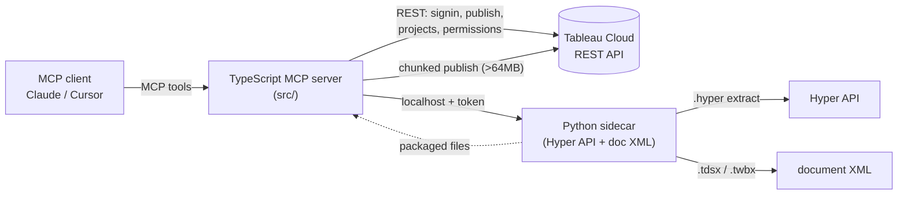

# tableau-mcp-publish

> The **write side** of Tableau MCP. The official `@tableau/mcp-server` lets an agent
> **read and query** Tableau (VizQL Data Service, Metadata API, Pulse). This server lets an agent
> **author and publish** — turn a SQL query or a DataFrame into a governed published datasource,
> generate a starter workbook, and publish both to Tableau Cloud. Built on the Tableau REST API,
> the Hyper API, and hand-authored Tableau document XML. Drops into the **same MCP client config**
> as the official server.

[](https://github.com/SebAustin/tableau-mcp-publish/actions/workflows/ci.yml)
[](LICENSE)

## Why this exists

Tableau's official MCP server is excellent and intentionally scoped to **reading**. It has no
tools to *create* a datasource, *author* a workbook, or *publish* anything to Cloud.

That's the half I build with all day as a Tableau Ambassador, so I built the companion. Run them
together and an agent goes from *"query this data"* to *"now publish a governed datasource and a
starter workbook to my Cloud site"* — without leaving the conversation.

## Run it alongside the official server

```json
{
  "mcpServers": {
    "tableau": {
      "command": "npx",
      "args": ["-y", "@tableau/mcp-server@latest"],
      "env": {
        "SERVER": "https://my-pod.online.tableau.com",
        "SITE_NAME": "mysite",
        "PAT_NAME": "my_pat",
        "PAT_VALUE": "…"
      }
    },
    "tableau-publish": {
      "command": "npx",
      "args": ["-y", "tableau-mcp-publish@latest"],
      "env": {
        "SERVER": "https://my-pod.online.tableau.com",
        "SITE_NAME": "mysite",
        "PAT_NAME": "my_pat",
        "PAT_VALUE": "…"
      }
    }
  }
}
```

Same env vars. The query server and the publish server share one Personal Access Token.

## What an agent can do with it

> **"Take the top 100 customers by revenue from Snowflake and publish it as a governed datasource
> called 'Top Customers' in the Sales project, then build a starter workbook with a bar chart of
> revenue by region."**

The agent calls, in sequence:

1. `create_datasource_from_query` — runs the SQL, builds a `.hyper` extract, packages a `.tdsx`,
   publishes to the Sales project → returns the datasource LUID + Cloud URL.
2. `create_starter_workbook` — generates a `.twbx` with a revenue-by-region bar chart bound to
   that datasource, publishes it → returns the workbook URL.

Two tool calls. A governed datasource and a workbook, live on Cloud.

## Prompt-driven authoring

Three new tools let an agent go from a plain-language business question straight to a published
dashboard — no manual sheet-spec assembly required.

### Datasource from a file

`create_datasource_from_file` reads any of CSV, JSON, JSONL, Excel (`.xlsx`/`.xls`), or Parquet
from local disk, materialises it as a Hyper extract, and publishes a `.tdsx` to Cloud.

```
create_datasource_from_file(
  name="Regional Sales",
  filePath="/data/sales.parquet",
  projectName="Analytics"
)
```

### Dashboard from a business question — the two-tool pattern

`design_dashboard` is a **pure planner**: it turns a business question, audience, and optional
field hints into a `DashboardPlan` JSON object. It never publishes anything.
`build_from_plan` is the **only side-effecting tool**: it consumes the plan, builds a `.twbx`
with worksheets and a tiled `<dashboard>`, and publishes to Cloud.

The split is deliberate. The agent can show the plan to the user, accept edits, then build —
without re-running an expensive publish on every refinement.

**End-to-end example — executive revenue dashboard from a Parquet file:**

> *"From `sales.parquet`, build an exec dashboard answering 'How is revenue trending by region?'"*

The agent calls:

1. `create_datasource_from_file` with `filePath="sales.parquet"`, `projectName="Analytics"` →
   returns `{ datasourceLuid, url }`.
2. `design_dashboard` with `mode="autonomous"`, `audience="exec"`,
   `businessQuestion="How is revenue trending by region?"`, the datasource LUID, and
   `fieldHints` obtained from `@tableau/mcp-server` → returns a `DashboardPlan` (≤3 sheets,
   KPI lead, bar + line).
3. `build_from_plan` with the plan → publishes the `.twbx`, returns `{ workbookLuid, url }`.

### Dashboard modes

| Mode | When to use |
|---|---|
| `autonomous` | Supply a business question; the planner derives sheets and layout. |
| `interview` | The planner returns 3–7 clarifying questions; pass answers back as `interview_followup`. |
| `interview_followup` | Answers to interview questions → full `DashboardPlan`. |
| `directed` | Provide explicit sheet directions (e.g. "a bar chart of revenue by region and a trend line"). |

The interview is a **stateless, two-call contract**: questions → plan. The server holds no
conversation state between calls; the agent supplies the full context on each call.

### Audience

`audience` shapes sheet count, mark types, density, and canvas size:

| Value | Max sheets | Canvas | Effect |
|---|---|---|---|
| `exec` | 3 | 1000×800 | KPI lead, large text, minimal axes |
| `analyst` | 8 | 1200×900 | Dense, scatter/map allowed, full axes |
| `operational` | 6 | 800×1200 | Status marks, mobile-friendly single column |
| `mixed` | 6 | 1000×900 | Balanced bar/line, one summary KPI |

## Tools

| Tool | What it does |
|---|---|
| `create_datasource_from_query` | SQL → `.hyper` → `.tdsx` → publish to Cloud |
| `create_datasource_from_table` | CSV / records → `.hyper` → `.tdsx` → publish |
| `create_datasource_from_file` | CSV / JSON / JSONL / Excel / Parquet → `.tdsx` → publish |
| `create_starter_workbook` | published datasource + NL sheet specs → `.twbx` → publish |
| `design_dashboard` | business question + audience → `DashboardPlan` (no publish) |
| `build_from_plan` | `DashboardPlan` → `.twbx` with dashboard → publish to Cloud |
| `publish_datasource` | publish an existing `.tdsx`/`.hyper` file |
| `publish_workbook` | publish an existing `.twb`/`.twbx` file |
| `list_projects` / `create_project` | project management |
| `set_permissions` | grant/deny capabilities on published content |
| `list_content` / `refresh_datasource` / `delete_content` | content lifecycle |

Full reference with parameters and example prompts in [`docs/tool_reference.md`](docs/tool_reference.md).

## Architecture



Two layers: a TypeScript MCP server (REST auth + publishing) and a Python FastAPI sidecar
(Hyper/`.tdsx`/`.twbx` authoring) the TS layer spawns over loopback. See
[`docs/architecture.md`](docs/architecture.md).

## Setup

```bash
git clone https://github.com/SebAustin/tableau-mcp-publish && cd tableau-mcp-publish
npm install && npm run build
cd sidecar && uv sync && cd ..
cp .env.example .env   # SERVER, SITE_NAME, PAT_NAME, PAT_VALUE
npm run dev            # starts the MCP server (stdio) + spawns the Python sidecar
```

Requirements: Node 22+, Python 3.12–3.13, and [`uv`](https://docs.astral.sh/uv/). Use the free
[Tableau Developer Program](https://www.tableau.com/developer) for a Cloud site to test against.

### Try the live demo

```bash
# with SERVER/SITE_NAME/PAT_NAME/PAT_VALUE and DEMO_PROJECT set in your environment:
npm run demo -- examples/top_customers.csv
```

It publishes a datasource and a starter workbook from a bundled CSV and prints both Cloud URLs.

## Relationship to the official server

This is a **companion, not a fork or a competitor.** It deliberately implements zero read/query
tools — for those, use `@tableau/mcp-server`. See
[`docs/relationship_to_official.md`](docs/relationship_to_official.md). The publish tools are
designed so this could be proposed upstream as the authoring extension if the maintainers want it.

## Development

```bash
make ci   # build + lint + test (TS) and ruff + mypy --strict + pytest (sidecar)
```

## Sources

1. Tableau. *Official Tableau MCP server.* <https://github.com/tableau/tableau-mcp>, 2026.
2. Tableau. *REST API reference — publishing datasources and workbooks.* help.tableau.com, 2026.
3. Tableau. *Hyper API documentation.* help.tableau.com/current/api/hyper_api, 2026.
4. Tableau. *Datasource (.tds) and workbook (.twb) XML format.* 2026.

## License

MIT © Sebastien Henry
