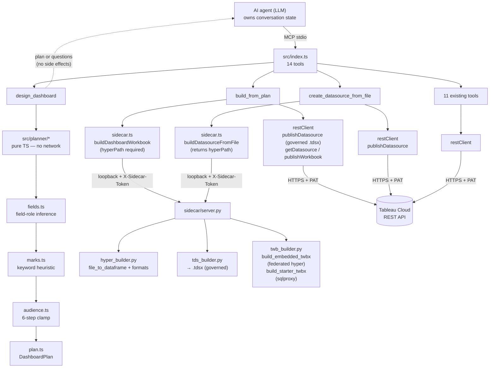

# Architecture

`tableau-mcp-publish` is two layers that share a machine but split responsibilities cleanly.

## TypeScript MCP server (`src/`)

- **`index.ts`** — MCP server entry (stdio). Loads config, signs in to Tableau, spawns the
  sidecar, registers all 14 tools, and handles graceful shutdown (sign out + stop sidecar).
- **`config.ts`** — env-var config (`SERVER`, `SITE_NAME`, `PAT_NAME`, `PAT_VALUE`,
  `TABLEAU_API_VERSION`, `SIDECAR_HOST/PORT`), validated with zod. Errors never echo the PAT.
- **`restClient.ts`** — Tableau REST client over `undici`: PAT sign-in, projects, content,
  permissions, and publishing. Publishing chooses **single multipart** (<64 MB) or **chunked
  `fileUploads`** (≥64 MB, incl. exactly 64 MB); a failed chunk aborts without finalizing.
- **`sidecar.ts`** — spawns the Python sidecar and calls it over loopback HTTP with a per-spawn
  `X-Sidecar-Token` header. Provides `buildDatasourceFromFile` and `buildDashboardWorkbook`
  alongside the existing methods.
- **`tools/`** — one module per tool group; each registers `McpServer.registerTool` with a zod
  input schema, an output schema, and an agent-readable description.
- **`planner/`** — pure TypeScript planning pipeline (no network, no side effects). Used only
  by `design_dashboard`.

## TypeScript planner (`src/planner/`)

The planner is a deterministic, stateless pipeline. Given the same inputs it always returns the
same plan. No LLM calls, no `Date.now()`, no randomness. Each stage is an independently testable
pure function.

```
fieldHints
  └─▶ fields.ts   — field-role inference (dtype → role, 8 name-pattern regexes, cardinality,
  │                  suppress flag for identifiers)
  └─▶ marks.ts    — keyword→markType heuristic (7 priority rules per clause, no-dimension
  │                  downgrade, gap annotations G-01..G-05)
  └─▶ audience.ts — 6-step audience clamp (truncate → drop disallowed marks → KPI lead →
  │                  enforce layout → cap measures/dims per sheet → map guard)
  └─▶ plan.ts     — wires the stages; applies L-01 analyst layout override; returns DashboardPlan
  └─▶ schema.ts   — single Zod source of truth for DashboardPlan / ClarifyingQuestions /
                     SheetSpec / DatasourceSpec; schemaVersion = 1 guard
```

`questions.ts` handles `interview` mode independently: it selects 3–7 questions from a fixed
ordered bank based on which inputs are unknown, then returns a `ClarifyingQuestions` object. No
plan is generated during interview mode.

The `DashboardPlan` schema (in `schema.ts`) is the explicit, versioned contract between
`design_dashboard` (producer) and `build_from_plan` (consumer). Both tools import from this
single module.

## Python authoring sidecar (`sidecar/`)

- **`server.py`** — FastAPI app with six routes, guarded by the shared `X-Sidecar-Token`
  middleware:

  | Route | Purpose |
  |---|---|
  | `GET /health` | Liveness probe |
  | `POST /datasource/from-query` | SQL/CSV → `.hyper` → `.tdsx` |
  | `POST /datasource/from-table` | JSON records or CSV path → `.tdsx` |
  | `POST /datasource/from-file` | CSV / JSON / JSONL / Excel / Parquet → `.tdsx` + returns `hyperPath` |
  | `POST /workbook/starter` | Published datasource → `.twbx` (loose worksheets, `sqlproxy`) |
  | `POST /workbook/dashboard` | Sheet specs → self-contained `.twbx` with embedded `.hyper` extract |

- **`hyper_builder.py`** — DataFrame/SQL/CSV/file → `.hyper` via pantab (Hyper types inferred
  from pandas dtypes). `file_to_dataframe()` dispatches on `fileType`: csv → `pd.read_csv`;
  json → `pd.read_json`; jsonl → `pd.read_json(lines=True)`; xlsx/xls → `pd.read_excel`
  (openpyxl); parquet → `pd.read_parquet` (pyarrow).
- **`tds_builder.py`** — packages a `.hyper` into a `.tdsx` (hand-built `.tds` XML with a `hyper`
  connection + per-column metadata, zipped with the extract under `Data/`).
- **`twb_builder.py`** — two distinct workbook-building paths:
  - **`build_starter_twbx`** (`/workbook/starter`) — binds to a *published* datasource via
    `class='sqlproxy'` + `repository-location`. No data is embedded. Used for loose-worksheet
    starter workbooks where the datasource is already live on the server.
  - **`build_embedded_twbx`** (`/workbook/dashboard`) — embeds the `.hyper` extract directly
    (`class='federated'` → named-connection `class='hyper'`), producing a self-contained `.twbx`
    that renders on Tableau Cloud without a separately published datasource binding. This is the
    path used by `build_from_plan` and is verified live at
    `https://10ax.online.tableau.com/#/site/sebaustin/workbooks/2420435`. The `<datasource>`
    element uses `federated.{slug}` as the internal name, carries no `<repository-location>`, and
    includes an `<extract>` block so Tableau Cloud recognises the file as an embedded extract.

  Both paths share `_build_dashboard()` and `_tile_zones()` for the `<dashboard>` XML block.

## Dashboard XML structure

When `build_from_plan` calls `/workbook/dashboard` with a `hyperPath`, the sidecar calls
`build_embedded_twbx`. The resulting `.twbx` zip contains:

- `{slug}.twb` — the workbook XML with a federated datasource connection and a `<dashboard>` block
- `Data/{filename}.hyper` — the raw extract Tableau Cloud reads directly

The dashboard XML block structure:

```xml
<dashboards>
  <dashboard name="Dashboard 1">
    <style/>
    <size maxheight="{H}" maxwidth="{W}" minheight="{H}" minwidth="{W}" />
    <zones>
      <zone h="100000" id="1" type-v2="layout-basic" w="100000" x="0" y="0">
        <!-- worksheet zones MUST be inside a layout-flow container -->
        <zone h="100000" id="2" param="vert" type-v2="layout-flow" w="100000" x="0" y="0">
          <zone h="50000" id="3" name="Revenue by Region" w="100000" x="0" y="0">
            <layout-cache cell-count-h="1" cell-count-w="1" type-h="cell" type-w="cell"/>
          </zone>
          <zone h="50000" id="4" name="KPI" w="100000" x="0" y="50000">
            <layout-cache cell-count-h="1" cell-count-w="1" type-h="cell" type-w="cell"/>
          </zone>
        </zone>
      </zone>
    </zones>
  </dashboard>
</dashboards>
```

Worksheet zones have no `type`/`type-v2` attribute — they are identified by `name` alone. Zones
must be nested inside a `layout-flow` container (not directly in `layout-basic`); placing them
directly in the canvas zone causes Tableau Cloud to reject the dashboard with error 400011. Each
worksheet window also requires a `<viewpoint/>` element (after `<cards>`) and each dashboard
window requires a `<viewpoints>` block with one `<viewpoint name="..."/>` per sheet — both
requirements are enforced by the render engine at runtime even though the XSD marks them optional.

Zones use a 0–100000 coordinate grid (independent of the canvas pixel size). `_tile_zones()`
divides the grid evenly; the last zone absorbs the rounding remainder so the total always equals
100,000. Canvas dimensions `W` × `H` come from `AUDIENCE_CONSTRAINTS[audience]` in `audience.ts`
and are passed through `build_from_plan` → sidecar → `<size>`.

## Two workbook paths: embedded vs. starter

The two `.twbx` paths serve different purposes and must not be confused:

| | `/workbook/dashboard` (embedded extract) | `/workbook/starter` (sqlproxy) |
|---|---|---|
| Datasource binding | Federated `.hyper` zipped inside the `.twbx` | `repository-location` + `class='sqlproxy'` pointer to a published datasource |
| Renders on Tableau Cloud | Yes — data travels with the workbook | Only when the referenced datasource is already published |
| Requires `hyperPath` | Yes (path to the `.hyper` file from `/datasource/from-file`) | No — uses `datasourceContentUrl` + `site` |
| Used by | `build_from_plan` | `create_starter_workbook` |
| Governed datasource | Published separately via `.tdsx` (independent artifact) | The binding IS the published datasource |

## Component and data-flow diagram



## Stateless boundary — the key design invariant

The MCP server is a stateless stdio subprocess. The intelligence about business questions, visual
direction, and conversation history lives entirely in the calling agent (Claude, Cursor, etc.).

| Concern | Owner | Why |
|---|---|---|
| Understanding business questions, judging answers | Calling agent | LLM work; the agent already has the model |
| Conversation history, relaying questions/answers | Calling agent | MCP is request/response; no session memory |
| Deterministic plan generation (field inference → marks → clamps) | Server (`src/planner/`) | Predictable, unit-testable without an LLM call |
| File authoring (`.hyper`/`.tdsx`/`.twb`) and REST publish | Server (Python sidecar + TS REST) | Reuses the proven baseline chain |

Consequence: every planner output is a pure function of its inputs. The interview mode is bounded
to **at most two `design_dashboard` calls** — questions then plan — before `build_from_plan` runs.

## Boundary

REST calls and auth live in TypeScript. All Tableau file authoring lives in Python — the Hyper
and document formats are Python-first, so there is no reason to reimplement them in TS. The
sidecar never touches the network except localhost. The TS planner (`src/planner/`) produces only
structural plans (no network), so it does not cross the TS/Python boundary.

## Why a sidecar (vs. one language)

The MCP ecosystem and the official Tableau server are TypeScript; matching that lets this server
drop into the same client config. But the Hyper API and the practical tooling for `.hyper`/`.tdsx`
authoring are Python. A spawned, token-guarded localhost sidecar gets the best of both without a
network dependency or a reimplementation.

See `docs/publish_lifecycle.md` for the end-to-end create → package → publish flow, and the ADRs
in `docs/adr.md` for the key decisions.
