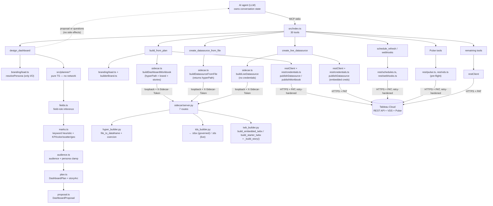

# Architecture

`tableau-mcp-publish` is two layers that share a machine but split responsibilities cleanly.

## TypeScript MCP server (`src/`)

- **`index.ts`** — MCP server entry (stdio). Loads config, signs in to Tableau, spawns the
  sidecar, registers all **30 tools** (`registerAllTools`), and handles graceful shutdown (sign
  out + stop sidecar).
- **`config.ts`** — env-var config (`SERVER`, `SITE_NAME`, `PAT_NAME`, `PAT_VALUE`,
  `TABLEAU_API_VERSION`, `SIDECAR_HOST/PORT`), validated with zod. Errors never echo the PAT.
- **`restClient.ts`** — Tableau REST client over `undici`: PAT sign-in, projects, content,
  permissions, and publishing. Publishing chooses **single multipart** (<64 MB) or **chunked
  `fileUploads`** (≥64 MB, incl. exactly 64 MB); a failed chunk aborts without finalizing.
  Delegates schedule/webhook/Pulse/VDS request-building to the `rest/` module family below.
- **`sidecar.ts`** — spawns the Python sidecar and calls it over loopback HTTP with a per-spawn
  `X-Sidecar-Token` header. Provides `buildDatasourceFromFile`, `buildLiveDatasource`,
  `buildDashboardWorkbook`, and the earlier `buildDatasourceFromQuery`/`buildDatasourceFromTable`/
  `buildStarterWorkbook` methods.
- **`tools/`** — one module per tool group; each registers `McpServer.registerTool` with a zod
  input schema, an output schema, and an agent-readable description.
- **`planner/`** — pure TypeScript planning pipeline (no network, no side effects). Used only
  by `design_dashboard`.
- **`branding/`** — brand-kit loading + persona resolution (below).
- **`rest/`** — REST/VDS/Pulse request-building + retry policy (below).

## `src/rest/` — REST/VDS/Pulse module family + retry policy

Split out of `restClient.ts` as the tool surface grew past the original publish/CRUD set, so each
protocol family (classic XML `tsRequest`, JSON VDS, JSON Pulse) owns its own request/response
shapes without bloating one file:

| Module | Owns | Wire format |
|---|---|---|
| `rest/xml.ts` | `xmlEscape`, `asArray` (Tableau's single-child-collapses-to-object XML→JSON quirk) — shared by every XML-body module below. | — |
| `rest/errors.ts` | `TableauApiError` (typed, `status`/`code`/`summary`/`detail`/`retriable`), `parseTableauErrorBody`, `parseRetryAfterMs`. Error messages never echo the raw response body — only status/method/path/summary — so a PAT or upstream internal can never leak through a logged/surfaced error. | JSON error envelope `{"error":{...}}` |
| `rest/retry.ts` | `withRetry()` — the shared bounded retry/backoff loop (below). Deliberately Tableau-agnostic so any REST module can reuse it. | — |
| `rest/vds.ts` | `readDatasourceMetadata()` — real field names/types/default aggregations for `get_datasource_fields` and Pulse pre-flight. | JSON, fixed path `/api/v1/vizql-data-service/read-metadata` (version-independent) |
| `rest/schedules.ts` | Extract-refresh task XML (create/update/runNow) + frequency-specific interval validation (`validateScheduleSpec`) for `schedule_refresh`. | XML `tsRequest`, versioned `/api/{v}/sites/{id}/tasks/extractRefreshes` |
| `rest/webhooks.ts` | Webhook create/list/delete XML + HTTPS-only validation for `create_webhook`. | XML `tsRequest`, versioned `/api/{v}/sites/{id}/webhooks` |
| `rest/credentials.ts` | `buildConnectionCredentialsXml()` — the `<connectionCredentials>` element embedded in a Publish Datasource request for `create_live_datasource`. Every attribute `xmlEscape`d; the password is never logged (asserted in `tests/secrets.test.ts`/`tests/credentials.test.ts`). | XML fragment, nested in the publish `tsRequest` |
| `rest/pulse.ts` | Pulse definition/metric create/list/delete bodies, mirroring Tableau's official `pulse-api-utilities` reference exactly, plus `validatePulsePreflight()` (VDS-backed field/date-type check). | **JSON** (not XML), fixed path `/api/-/pulse/...` (version-independent, literal hyphen) |

### Retry policy

`withRetry()` (`rest/retry.ts`) is one bounded exponential-backoff loop shared by `restClient.ts`
(the classic API), `rest/vds.ts`, and `rest/pulse.ts`:

- Retries only `429`, `502`, `503`, `504` — **never** `401`, never any other `4xx`.
- Only retries when the call is **idempotent** (GET, or a caller-classified idempotent case) —
  repeating a non-idempotent mutation risks duplicating a server-side effect if the original
  request actually succeeded but the response was lost. POST/DELETE are generally *not* retried;
  `rest/pulse.ts` is deliberately more conservative than the rest of the codebase and never retries
  POST/DELETE at all (its delete-response shape is itself an unconfirmed VERIFY-LIVE detail).
- Honors an upstream `Retry-After` header when present; otherwise uses "full jitter" exponential
  backoff (`baseDelayMs=200`, `maxDelayMs=2000`, `maxAttempts=3`, `totalTimeCapMs=8000` by
  default) — deterministic in tests via injectable `sleep`/`jitterFn`/`now`.
- On exhaustion, rethrows the last error unchanged so the caller sees the same clear, actionable
  message either way.

## `src/branding/` — brand kit + persona resolution

`brand.yaml` (repo root) is the single source of brand truth: categorical/sequential/diverging
color palettes, semantic good/bad/neutral colors, title/body/BAN typography, number formats, and
named personas. Every field is optional and defaults are baked into the zod schema itself
(`BrandFileSchema.parse({})` is a fully-populated, valid `BrandFile`), so "file absent" and "file
present but sparse" are handled identically.

| Module | Responsibility |
|---|---|
| `branding/schema.ts` | Zod schema for the whole `brand.yaml` document (`brand`, `palette`, `typography`, `formats`, `rules`, `personas`), with every leaf field defaulted. |
| `branding/load.ts` | The **only** I/O in the branding layer. `loadBrand(path?)` reads/parses/validates the file (absent file → defaults + a warning; malformed YAML or a schema violation → throws with the field path); `resolvePersona(brand, name)` resolves a case-insensitive persona name to its base audience + overrides, throwing with the full persona list on an unknown name. |
| `branding/builderBrand.ts` | Pure projection from the nested, zod-validated `BrandFile` down to the flat wire shape (`BuilderBrand`) the sidecar's `BrandModel` expects — no I/O, no additional defaulting. |

**Invariant:** the planner (`src/planner/*`) and the sidecar (`sidecar/twb_builder.py`) never read
`brand.yaml` directly. `src/tools/designDashboard.ts` is the only place that resolves a persona
(audience + `chartDeny`/`kpiEmphasis`/`preferredArtifact`/`tone` overrides) and passes plain,
already-resolved values into the pure planner — "planner stays pure: pass resolved values in."
`src/tools/buildFromPlan.ts` separately re-reads `brand.yaml` (when `plan.personaName`/
`plan.brandName`/an explicit `brandPath` is present) and projects it via `toBuilderBrand()` before
calling the sidecar.

## TypeScript planner (`src/planner/`)

The planner is a deterministic, stateless pipeline. Given the same inputs it always returns the
same plan/proposal. No LLM calls, no `Date.now()`, no randomness. Each stage is an independently
testable pure function.

```
fieldHints
  └─▶ fields.ts    — field-role inference (dtype → role, name-pattern regexes, cardinality,
  │                   suppress flag for identifiers)
  └─▶ marks.ts     — keyword→markType heuristic, KPI-strip construction (comparison/delta
  │                   binding), color/scatter/geo encoding, small-multiples + top-N hints
  └─▶ audience.ts  — multi-step audience clamp (truncate → drop disallowed marks → persona
  │                   chartDeny veto → KPI lead → kpiEmphasis cap → enforce layout → cap
  │                   measures/dims per sheet → map guard)
  └─▶ plan.ts      — wires the stages; builds the exec KPI-band layout; builds storyArc when
  │                   warranted (see below); returns DashboardPlan
  └─▶ proposal.ts  — projects a DashboardPlan into a human-readable DashboardProposal
  │                   (summary, kpiStrip, views, layoutSummary, storyOutline, openQuestions)
  └─▶ schema.ts    — single Zod source of truth for DashboardPlan / ClarifyingQuestions /
                      DashboardProposal / SheetSpec / DatasourceSpec; schemaVersion = 1 guard
```

`questions.ts` handles `interview` mode independently: it selects 3–7 questions from a fixed
ordered bank based on which inputs are unknown, then returns a `ClarifyingQuestions` object. No
plan is generated during interview mode.

The `DashboardPlan`/`DashboardProposal` schemas (in `schema.ts`) are the explicit, versioned
contract between `design_dashboard` (producer) and `build_from_plan` (consumer). Both tools import
from this single module. `design_dashboard` returns a `DashboardProposal` (never a bare plan) for
every mode except `interview`; the proposal embeds the plan verbatim in its `plan` field for the
agent to pass, unchanged, to `build_from_plan` on user confirmation (the propose→confirm loop —
see the README and ADR-0007).

### `storyArc` — deterministic story generation

`plan.ts`'s `buildStoryArc()` emits an ordered `StoryArcPoint[]` (`{ caption, capturedSheet }`)
when either (a) the resolved persona's `preferredArtifact` is `"story"`, or (b) the business
question itself uses story/narrative/presentation language. Every `capturedSheet` is guaranteed to
name one of the plan's own `sheets[].title` values — `buildStoryArc()` only ever emits references
into the same sheet list it's building alongside. `proposal.ts`'s `buildStoryOutline()` surfaces
the ordered captions as `DashboardProposal.storyOutline` and folds a one-sentence story summary
into `proposal.summary`, so a story arc is visible to the confirming user without digging into the
plan JSON. `build_from_plan` re-validates every `capturedSheet` reference before calling the
sidecar (defense in depth — the sidecar validates a third time against the actual built workbook).

## Python authoring sidecar (`sidecar/`)

- **`server.py`** — FastAPI app with **seven routes**, guarded by the shared `X-Sidecar-Token`
  middleware:

  | Route | Purpose |
  |---|---|
  | `GET /health` | Liveness probe |
  | `POST /datasource/from-query` | SQL/CSV → `.hyper` → `.tdsx` |
  | `POST /datasource/from-table` | JSON records or CSV path → `.tdsx` |
  | `POST /datasource/from-file` | CSV / JSON / JSONL / Excel / Parquet → `.tdsx` + returns `hyperPath` + real column schema (numeric/date coercion applied) |
  | `POST /datasource/live` | Snowflake/Presto connection topology → `.tds` (no extract, no credentials — see `create_live_datasource`) |
  | `POST /workbook/starter` | Published datasource → `.twbx` (loose worksheets, `sqlproxy`) |
  | `POST /workbook/dashboard` | Sheet specs (+ optional brand block, optional stories) → self-contained `.twbx` with embedded `.hyper` extract |

- **`hyper_builder.py`** — DataFrame/SQL/CSV/file → `.hyper` via pantab (Hyper types inferred
  from pandas dtypes). `file_to_dataframe()` dispatches on `fileType`: csv → `pd.read_csv`
  (encoding/delimiter auto-sniffed when omitted); json → `pd.read_json`; jsonl →
  `pd.read_json(lines=True)`; xlsx/xls → `pd.read_excel` (openpyxl); parquet → `pd.read_parquet`
  (pyarrow). Numeric-looking and date-looking string columns are coerced to real
  int64/float64/datetime64 dtypes before the Hyper write, so a field like `Order Date` reaches VDS
  and Pulse pre-flight as a real `DATE`/`DATETIME`, not a string.
- **`tds_builder.py`** — packages a `.hyper` into a `.tdsx` (hand-built `.tds` XML with a `hyper`
  connection + per-column metadata, zipped with the extract under `Data/`). Also builds the
  **live-connection** `.tds` (`build_live_tds`) for `create_live_datasource`: a connection-only
  document (no `<extract>`, no embedded data) using `SNOWFLAKE_ATTRS`/`PRESTO_ATTRS` lookup tables
  — this attribute mapping is this project's best-documented guess and is VERIFY-LIVE (not yet
  confirmed against a Desktop-exported `.tds`). Snowflake key-pair auth is rejected here too (400)
  as a second line of defense behind the TS-layer check.
- **`twb_builder.py`** — three workbook-building capabilities:
  - **`build_starter_twbx`** (`/workbook/starter`) — binds to a *published* datasource via
    `class='sqlproxy'` + `repository-location`. No data is embedded. Used for loose-worksheet
    starter workbooks where the datasource is already live on the server.
  - **`build_embedded_twbx`** (`/workbook/dashboard`) — embeds the `.hyper` extract directly
    (`class='federated'` → named-connection `class='hyper'`), producing a self-contained `.twbx`
    that renders on Tableau Cloud without a separately published datasource binding. This is the
    path used by `build_from_plan` and is verified live (see `ACCEPTANCE.md`). The `<datasource>`
    element uses `federated.{slug}` as the internal name, carries no `<repository-location>`, and
    includes an `<extract>` block so Tableau Cloud recognises the file as an embedded extract.
  - **`_build_story()`** — emits a `<dashboard type='storyboard'>` (a Tableau Story) as a peer of
    regular dashboards, described below.

  All three paths share `_build_dashboard()` and `_tile_zones()` for the `<dashboard>` XML block,
  and a single shared `<dashboards>` container per workbook (regular dashboards first, then any
  stories) — an earlier per-call sibling-wrapper bug that violated the XSD was fixed by
  consolidating to one container.

## Dashboard XML structure

When `build_from_plan` calls `/workbook/dashboard` with a `hyperPath`, the sidecar calls
`build_embedded_twbx`. The resulting `.twbx` zip contains:

- `{slug}.twb` — the workbook XML with a federated datasource connection, a `<dashboard>` block,
  an optional `<preferences>` block (brand palette — see below), and optional story dashboards
- `Data/{filename}.hyper` — the raw extract Tableau Cloud reads directly

The dashboard XML block structure:

```xml
<dashboards>
  <dashboard name="Dashboard 1">
    <style/>
    <size maxheight="{H}" maxwidth="{W}" minheight="{H}" minwidth="{W}" />
    <zones>
      <zone h="100000" id="1" type-v2="layout-basic" w="100000" x="0" y="0">
        <!-- worksheet zones MUST be inside a layout-flow container -->
        <zone h="100000" id="2" param="vert" type-v2="layout-flow" w="100000" x="0" y="0">
          <zone h="50000" id="3" name="Revenue by Region" w="100000" x="0" y="0">
            <layout-cache cell-count-h="1" cell-count-w="1" type-h="cell" type-w="cell"/>
          </zone>
          <zone h="50000" id="4" name="KPI" w="100000" x="0" y="50000">
            <layout-cache cell-count-h="1" cell-count-w="1" type-h="cell" type-w="cell"/>
          </zone>
        </zone>
      </zone>
    </zones>
  </dashboard>
</dashboards>
```

Worksheet zones have no `type`/`type-v2` attribute — they are identified by `name` alone. Zones
must be nested inside a `layout-flow` container (not directly in `layout-basic`); placing them
directly in the canvas zone causes Tableau Cloud to reject the dashboard with error 400011. Each
worksheet window also requires a `<viewpoint/>` element (after `<cards>`) and each dashboard
window requires a `<viewpoints>` block with one `<viewpoint name="..."/>` per sheet — both
requirements are enforced by the render engine at runtime even though the XSD marks them optional.

Zones use a 0–100000 coordinate grid (independent of the canvas pixel size). `_tile_zones()`
divides the grid evenly; the last zone absorbs the rounding remainder so the total always equals
100,000. Canvas dimensions `W` × `H` come from `AUDIENCE_CONSTRAINTS[audience]` in `audience.ts`
and are passed through `build_from_plan` → sidecar → `<size>`. When `plan.layoutGrammar.kind` is
`"kpi_band_over_charts"`, the sidecar emits a 2-zone layout instead (a horizontal KPI strip above a
tiled chart row) rather than a single flat tile row.

## Brand and story blocks on `/workbook/dashboard`

`DashboardWorkbookRequest` (the request model for `/workbook/dashboard`) carries two additional
optional blocks, both absent-by-default and byte-identical to pre-branding/pre-story output when
omitted:

- **`brand`** (`BrandModel`) — mirrors `branding/builderBrand.ts`'s flat `BuilderBrand` shape.
  When present, `twb_builder.py` emits a `<preferences><color-palette custom='true' name='{brand
  name} Palette'>` block, applies the brand's title/body font specs to text runs, and attaches
  `default-format` (currency/percent/number) to measure columns classified by field name.
- **`stories`** (`StoryModel[]`) — see below.

**The "model_dump lesson"** (documented at each sub-model in `server.py`): every Pydantic model in
the request accepts **camelCase** on the wire (via `alias=`), but `.model_dump()` — the only way
`twb_builder.py` ever sees this data — produces the **snake_case field names**, never the aliases.
`twb_builder.py` reads `brand_name`, not `brandName`; `captured_sheet`, not `capturedSheet`. This
is a recurring gotcha called out at every camelCase/snake_case boundary in the sidecar.

## Story (storyboard) XML structure

A `Story` (`{ name, navType?, points: [{ caption, capturedSheet }] }`) becomes a
`<dashboard type='storyboard'>` — a sibling of regular dashboards inside the *same* shared
`<dashboards>` container, built by `twb_builder.py`'s `_build_story()`:

```xml
<dashboard name="Story: Q4 Review" type="storyboard">
  <style/>
  <size maxheight="{H}" maxwidth="{W}" minheight="{H}" minwidth="{W}" />
  <zones>
    <zone h="100000" id="1" type-v2="layout-basic" w="100000" x="0" y="0">
      <zone h="100000" id="2" param="vert" type-v2="layout-flow" w="100000" x="0" y="0">
        <zone h="7500" id="3" type="title" w="100000" x="0" y="0"/>
        <zone h="8000" id="4" is-fixed="true" paired-zone-id="5" type="flipboard-nav"
              w="100000" x="0" y="7500"/>
        <zone h="84500" id="5" paired-zone-id="4" type="flipboard" w="100000" x="0" y="15500">
          <flipboard active-id="1" nav-type="caption" show-nav-arrows="true">
            <story-points>
              <story-point caption="Headline KPIs" captured-sheet="KPI" id="1"/>
              <story-point caption="Sales by Category" captured-sheet="Sales by Category" id="2"/>
              <!-- one <story-point> per storyArc entry -->
            </story-points>
          </flipboard>
        </zone>
      </zone>
    </zone>
  </zones>
  <simple-id uuid="…"/>
</dashboard>
```

Notable, verified-against-a-real-Tableau-export details:

- The title / flipboard-nav / flipboard zones use a bare `type='…'` attribute — **not**
  `type-v2` (every other zone kind in this codebase uses `type-v2`). This is the exact attribute
  spelling a real Tableau-authored story uses; the official XSD accepts it via an
  `anyAttribute namespace='##local'` wildcard rather than declaring `type` explicitly.
- Vertical split is fixed: title ~7.5%, nav bar ~8%, flipboard content absorbs the remainder.
- Every `captured-sheet` must name an existing worksheet or regular-dashboard name already defined
  in the workbook. `_build_story()` raises `ValueError` (listing every valid name) on any
  mismatch — this is the third and final validation layer, after the planner's `buildStoryArc()`
  (which only emits references to its own plan's sheets) and `build_from_plan`'s
  `assertStoryArcCapturedSheetsExist()` re-check.
- `build_from_plan` applies the `"Story: "` name prefix Tableau's story-dashboard naming convention
  expects before handing `plan.storyArc` to the sidecar as a single `Story`.

## Two workbook paths: embedded vs. starter

The two `.twbx` paths serve different purposes and must not be confused:

| | `/workbook/dashboard` (embedded extract) | `/workbook/starter` (sqlproxy) |
|---|---|---|
| Datasource binding | Federated `.hyper` zipped inside the `.twbx` | `repository-location` + `class='sqlproxy'` pointer to a published datasource |
| Renders on Tableau Cloud | Yes — data travels with the workbook | Only when the referenced datasource is already published |
| Requires `hyperPath` | Yes (path to the `.hyper` file from `/datasource/from-file`) | No — uses `datasourceContentUrl` + `site` |
| Used by | `build_from_plan` | `create_starter_workbook` |
| Governed datasource | Published separately via `.tdsx` (independent artifact) | The binding IS the published datasource |
| Brand / story support | Yes (`brand`, `stories` request fields) | Yes (same request fields, same builder helpers) |

## Component and data-flow diagram



## Stateless boundary — the key design invariant

The MCP server is a stateless stdio subprocess. The intelligence about business questions, visual
direction, and conversation history lives entirely in the calling agent (Claude, Cursor, etc.).

| Concern | Owner | Why |
|---|---|---|
| Understanding business questions, judging answers | Calling agent | LLM work; the agent already has the model |
| Conversation history, relaying questions/answers/proposal edits | Calling agent | MCP is request/response; no session memory |
| Deterministic plan/proposal generation (field inference → marks → clamps → storyArc) | Server (`src/planner/`) | Predictable, unit-testable without an LLM call |
| Brand/persona resolution | Server (`src/branding/`), invoked only from the tool layer | Pure projection once resolved; keeps the planner filesystem-free |
| File authoring (`.hyper`/`.tdsx`/`.tds`/`.twb`) and REST publish | Server (Python sidecar + TS REST) | Reuses the proven baseline chain |

Consequence: every planner output is a pure function of its inputs. The interview mode is bounded
to **at most two `design_dashboard` calls** — questions then proposal — before `build_from_plan`
runs. The propose→confirm loop adds no server-side state either: a "change X" request is just
another `design_dashboard` call in `directed` mode.

## Boundary

REST calls and auth live in TypeScript. All Tableau file authoring lives in Python — the Hyper
and document formats are Python-first, so there is no reason to reimplement them in TS. The
sidecar never touches the network except localhost. The TS planner (`src/planner/`) and branding
layer (`src/branding/`) produce only structural plans and resolved config (no network), so neither
crosses the TS/Python boundary.

## Why a sidecar (vs. one language)

The MCP ecosystem and the official Tableau server are TypeScript; matching that lets this server
drop into the same client config. But the Hyper API and the practical tooling for `.hyper`/`.tdsx`
authoring are Python. A spawned, token-guarded localhost sidecar gets the best of both without a
network dependency or a reimplementation.

See `docs/publish_lifecycle.md` for the end-to-end create → package → publish flow, `docs/adr/`
for per-decision ADRs (the propose→confirm contract, REST retry policy, live-connection credential
handling, the local-file refresh design-around, Pulse's best-effort payload, and the shared story
`<dashboards>` container), and `docs/runbook.md` for how to run and troubleshoot the system.
