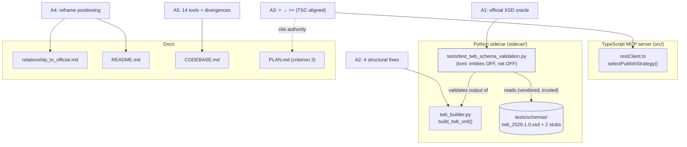

# ADAPTATION_PLAN.md — Ecosystem-Review Adaptations A1–A5

Branch: `feat/prompt-driven-authoring` (continue on it).
Baseline: `make ci` GREEN — 75 TS + 71 Python = **146 tests**.
Source of truth: [`REVIEW.md`](./REVIEW.md) (verdict table + adaptation backlog A1–A5).

This plan formalizes the five research-derived adaptations from `REVIEW.md` into a
dependency-ordered, binary-testable build. It mirrors the rigor of the root
[`PLAN.md`](../../PLAN.md): every success criterion is binary and checkable, every change
maps to a verification, and the regression posture is stated explicitly.

> **Scope guard.** This is a *plan only*. No code, tests, schemas, or deps are modified by
> writing this document. The backlog is small and surgical: two Python source defects, one
> TypeScript one-byte boundary, one new test file + vendored schema, and two doc refreshes.

---

## 0. Objective & success criteria (binary, testable)

The adaptation is **done** when all of the following hold on `make ci`:

| # | Criterion | How checked |
|---|---|---|
| O-1 | The new XSD-validation pytest passes for **both** the worksheets-only and with-dashboard outputs of `build_twb_xml()`. | `uv run pytest sidecar/tests/test_twb_schema_validation.py` green |
| O-2 | All **146** pre-existing tests still pass, **except** the specific `twb` structural assertions intentionally re-baselined under A2 (enumerated in §A2.4); total test count is **≥ 146 + new A1 cases**. | `make ci` green; diff of changed assertions reviewed |
| O-3 | `selectPublishStrategy(64 MiB) === "chunked"` and `selectPublishStrategy(64 MiB − 1) === "single"`. | `tests/restClient.test.ts` boundary test |
| O-4 | Root `PLAN.md` criterion 3 wording matches the new `>=` boundary and cites TSC. | doc diff |
| O-5 | `lxml` parses the vendored XSD with **entity resolution OFF and network access OFF** (no XXE surface). | parser-config assertion in the new test (§A1.5) |
| O-6 | The vendored XSD does **not** enter the npm tarball. | `npm pack --dry-run` shows no `sidecar/tests/**` |
| O-7 | `docs/relationship_to_official.md`, `README.md`, `CODEBASE.md` reflect the **14-tool** surface, correct transport/auth/Node floor, and the reframed positioning. | doc review against checklist §A4/§A5 |
| O-8 | `mypy --strict` and `ruff` stay clean on the sidecar; `tsc` + `eslint` stay clean on TS. | `make ci` |

`make ci` runs: `build lint test sidecar-lint sidecar-typecheck sidecar-test` (see
[`Makefile`](../../Makefile)). The XSD gate runs inside `sidecar-test`.

---

## 1. Architecture impact & trust boundaries

The adaptations touch three of the system's surfaces; none change the topology (TS MCP
server over stdio + localhost Python sidecar; REST/auth in TS; file authoring in Python).



**Trust boundaries affected:**

- **New file-read boundary (A1).** The test parses two *vendored, trusted* files (the XSD +
  two import stubs we author) and validates *our own* generated XML string. There is no
  untrusted input. Even so, the parser is configured defensively: `resolve_entities=False`,
  `no_network=True`, `load_dtd=False`, `huge_tree=False`. This is belt-and-suspenders against
  XXE/billion-laughs in case the schema set is ever swapped for an externally sourced one.
- **No new network egress.** The sidecar still touches only localhost; the XSD is on disk.
  `no_network=True` makes the no-egress property *enforced by the parser*, not merely assumed.
- **Publish boundary (A3) is unchanged in shape** — only the single↔chunked decision point
  shifts by one byte to match official TSC, removing a latent multipart-overhead rejection at
  exactly 64 MiB.

---

## 2. Dependency-ordered build sequence

The sequence is chosen so the **A1 XSD gate becomes the oracle that proves A2** (RED → fix →
GREEN), and the independent A3 + docs work follows. Each milestone is independently
committable and leaves `make ci` in a known state.

```
M1  A1 scaffold (RED)   → vendor XSD + stubs, add lxml dev dep, write the validation test
                          against TODAY's output. Expect it to FAIL on the 4 defects.
M2  A2 fixes (GREEN)     → apply the 4 structural fixes in twb_builder.py until the M1 test
                          passes; re-baseline the affected structural assertions.
M3  A3 boundary          → flip `>` to `>=`, update JSDoc + boundary test + root PLAN.md crit 3.
M4  A4 docs              → reframe relationship_to_official.md + README.md.
M5  A5 docs              → CODEBASE.md 11→14 tools, divergences, non-adoptions.
```

**Why this order:**

1. **M1 before M2 (test-first / RED).** Writing the XSD test *first*, against unmodified
   `twb_builder.py`, produces a failing test that *enumerates the exact defects* — the
   strongest possible specification for the A2 fix. This is the TDD RED→GREEN loop applied to
   a fidelity gate: the oracle exists before the fix.
2. **M2 depends on M1.** The fixes are "make the M1 test pass"; without M1 there is no
   objective definition of *schema-valid*.
3. **M3 is independent** of M1/M2 (different language, different file) and could run in
   parallel, but is sequenced after to keep one green checkpoint per commit.
4. **M4/M5 depend on M2 + M3 being final** only insofar as A5 documents the post-A3 chunk
   boundary and the post-A2 dashboard ordering; doing docs last avoids re-editing them.

**Thinnest runnable slice:** M1 alone is runnable (`uv run pytest -k schema_validation`) and
delivers value immediately — a red test that pinpoints four real "parses but won't render"
defects. That is the smallest end-to-end increment that exercises the new machinery.

---

## A1 — Official-XSD validation pytest (Code, value H)

### A1.1 What & why
Vendor the official TWB schema and wire it into pytest so our generated `.twb` XML is
validated against Tableau's own contract — the highest-value hardening in `REVIEW.md` §2.
This converts "parses but may not render" defects from *invisible* to *CI-blocking*.

### A1.2 Files
- `sidecar/tests/schemas/twb_2026.1.0.xsd` — vendored from
  `tableau/tableau-document-schemas`, path `schemas/2026_1/twb_2026.1.0.xsd`.
- `sidecar/tests/schemas/xml.xsd` — tiny stub resolving the unresolved `xml:` namespace
  import (xml:lang/xml:space/xml:base attribute group), so `lxml` can compile the schema
  offline.
- `sidecar/tests/schemas/user.xsd` — tiny stub resolving the unresolved `user:` namespace
  import referenced by the TWB schema.
- `sidecar/tests/test_twb_schema_validation.py` — the new test module.
- `sidecar/pyproject.toml` — add `lxml` to the **dev** dependency group only.
- `sidecar/uv.lock` — must be regenerated (see A1.6 — CI runs `--frozen`).

### A1.3 Vendoring provenance (record in the test module docstring)
Capture the upstream repo, file path, commit SHA, and retrieval date in the test's module
docstring and in a one-line `sidecar/tests/schemas/PROVENANCE.txt`. The two stubs are marked
as **authored locally** to satisfy the schema's unresolved imports — not vendored — so a
future reviewer does not look for them upstream. Pin to a specific upstream commit, not a
moving branch, so the oracle is reproducible.

### A1.4 lxml dependency placement
`lxml` goes in `[project.optional-dependencies].dev` (alongside `pytest`, `mypy`, `ruff`),
**never** in `[project.dependencies]`. Rationale: it is a *test-only* oracle; the runtime
authoring path uses stdlib `xml.etree.ElementTree` and must not gain a C-extension runtime
dependency. CI already installs dev via `uv sync --extra dev --frozen`
([`ci.yml`](../../.github/workflows/ci.yml) line 48), so no workflow edit is needed.

### A1.5 Test design (the oracle)
The module:
1. Loads the XSD once via `lxml.etree.XMLSchema`, parsed with a **hardened** `XMLParser`:
   `resolve_entities=False, no_network=True, load_dtd=False, huge_tree=False`. This is the
   XXE-safe configuration mandated by `REVIEW.md` A1 — applied even though both inputs are
   trusted.
2. Builds `build_twb_xml(...)` output for **two** cases and validates each against the XSD:
   - **worksheets-only** (e.g. the existing `SHEETS` fixture) — no `dashboards=` kwarg.
   - **with-dashboard** (e.g. `SHEETS_2` + `DASHBOARDS_BASIC`).
3. On validation failure, asserts with `schema.error_log` attached to the message so a RED
   run *names the offending element/line* — turning the test into a precise A2 spec.
4. Adds an explicit **parser-safety assertion** (O-5): a test that constructs the parser and
   asserts its config flags, so the XXE-safe posture is itself regression-guarded.

Suggested case count: 2 validation cases + 1 parser-safety case + 1 "schema compiles offline"
case = **4 new tests** (count is illustrative; the binary requirement is O-1 + O-5).

### A1.6 Operational note — `uv.lock` + `--frozen` (CRITICAL)
CI runs `uv sync --extra dev --frozen`. Adding `lxml` to `pyproject.toml` **without
regenerating `uv.lock`** will make `--frozen` fail (lock out of sync). M1 must run
`cd sidecar && uv lock` (or `uv sync --extra dev` to refresh the lock) and **commit the
updated `uv.lock`** in the same commit. Verify `lxml` resolves on **both** Python 3.12 and
3.13 (the CI matrix) before pushing.

### A1.7 Packaging note — no npm-tarball bloat (O-6)
`package.json` `files` is `["dist", "sidecar/*.py", "sidecar/pyproject.toml",
"sidecar/uv.lock"]`. It does **not** include `sidecar/tests/**`, so the vendored XSD and stubs
ship **only** in the git tree, not the published npm package. Confirm with
`npm pack --dry-run`. (`uv.lock` *is* in the allowlist and will carry the new `lxml` entry —
acceptable; it is metadata, not the schema blob.)

### A1.8 Verification
- O-1: both validation cases pass after A2.
- O-5: parser-safety test asserts entities OFF + network OFF.
- O-6: `npm pack --dry-run` lists no `sidecar/tests/` entry.
- O-8: `ruff`/`mypy --strict` clean (the test module is under `tests/`, excluded from mypy
  strict per `pyproject.toml` `exclude = ["tests/"]`, but must still pass `ruff`).

---

## A2 — Fix the 4 structural defects so output is schema-valid (Code, value H)

### A2.1 The four fixes (in `sidecar/twb_builder.py`)
Per `REVIEW.md` §2; the schema's element sequence is **Worksheets → Dashboards → Windows**.

1. **Dashboards before windows.** Today `build_twb_xml()` appends `<dashboards>` *after*
   `<windows>` (the dashboard block is appended inside the `if dashboards:` branch, after
   `<windows>` is built at line ~304). Re-order emission so `<dashboards>` is written
   **before** `<windows>`. The dashboard `<window class="dashboard">` entry still goes in
   `<windows>`; only the `<dashboards>` container moves ahead of `<windows>`.
2. **`<simple-id>` per worksheet.** Add the required `<simple-id>` child to each
   `<worksheet>` in `_build_worksheet()`. Use a stable, deterministic id (e.g.
   `uid = "{n}"` sequence or a slug of the title) so output stays deterministic for the
   byte-identical self-comparison guard (§A2.5).
3. **`<table>`/`<view>` child ordering.** The schema expects `<style>` before `<rows>`/`<cols>`
   inside `<table>`, and a specific order of `<view>` children (datasource reference,
   `datasource-dependencies`, then the rest). Re-order so: within `<table>` emit `<view>`,
   then `<style>` (add an empty/minimal `<style>` element if the schema requires it present),
   then `<rows>`, `<cols>`, `<panes>`; within `<view>` emit `<datasources>` then
   `<datasource-dependencies>` in the schema-mandated order.
4. **`cards`/`viewpoints` in `<window>`.** Add the required `<cards>` and `<viewpoints>`
   children to each `<window>` element emitted in the worksheets/dashboards loops.

> The exact child set/order is whatever makes the A1 XSD gate pass — the gate is the spec.
> Implement against the schema, not against guesses; the M1 RED error log lists each.

### A2.2 The `version="26.1"` decision (call it out)
`REVIEW.md` says the schema's version pattern already accepts the current string
(`TWB_VERSION = "18.1"`). **Default decision: do NOT change the workbook `version` attribute.**
Only bump to `version="26.1"` *if and only if* the A1 XSD gate fails specifically on the
version pattern. If it passes (expected), leave `TWB_VERSION` untouched and note in the commit
body that validation confirmed the existing string is accepted — avoiding an unnecessary,
blast-radius-widening change to every datasource/worksheet emission.

### A2.3 Blast radius (the critical part)
These four fixes change the **worksheet** and **window** structure used by the **existing
starter path too** (`build_starter_twbx` → `build_twb_xml` with `dashboards=None`), not just
the new dashboard path. So this is **not** a dashboard-only change. Two consequences:

- Every `.twb` we emit — starter and dashboard — gets new `<simple-id>`, re-ordered
  `<table>`/`<view>` children, and `<cards>`/`<viewpoints>` in windows.
- Structural assertions in `test_twb_builder.py` and `test_twb_dashboard.py` that pin element
  *positions* or *absence* may break and must be re-baselined to the new schema-valid output.

### A2.4 Assertions to re-baseline (enumerate, don't silently change)
Audit and, where structurally affected, update — documenting each as an **intended improving
change**, not a regression:

- `test_twb_builder.py`
  - `test_twb_references_published_datasource` — datasource/connection lookups use `.//`
    descendant axis, so element re-ordering should NOT break them; verify they still resolve.
  - `test_twb_one_worksheet_per_sheet_with_dependencies` — uses `.//datasource-dependencies`
    (descendant axis); re-ordering within `<view>` should keep it green; verify.
  - `test_twb_mark_class_per_type` — `.//pane/mark`; unaffected; verify.
  - `test_build_starter_twbx_is_valid_zip` — parses `<workbook>`; unaffected; verify.
  - **New positive assertion to add:** each `<worksheet>` now has a `<simple-id>` child;
    each `<window>` now has `<cards>` + `<viewpoints>`. Add these so the new structure is
    pinned and the fix is regression-guarded.
- `test_twb_dashboard.py`
  - `test_dashboard_zone_count_matches_sheets`, `test_dashboard_zone_names_match_titles`,
    size tests, `_tile_zones` geometry tests — all use descendant axis or call `_tile_zones`
    directly; expected to stay green; verify.
  - `test_default_none_dashboards_no_dashboards_element` — asserts `root.find("dashboards")
    is None` for the no-dashboard case; **still true** after the re-order (dashboards only
    emitted when requested); verify.
  - `test_default_none_regression_byte_identical` — see §A2.5; **survives unchanged**.

> Most existing assertions use the `.//` descendant axis and so are *robust* to re-ordering.
> The re-baseline surface is therefore small. Any assertion that *does* change gets a one-line
> comment `# re-baselined for schema-valid output (XSD A2); see ADAPTATION_PLAN §A2`.

### A2.5 Why the byte-identical guard stays safe (NOT a hidden regression)
`test_default_none_regression_byte_identical` compares **two live calls** to `build_twb_xml`
(default kwargs vs explicit `dashboards=None`) and asserts they are equal to **each other** —
there is **no stored golden-XML snapshot** anywhere in the repo (confirmed by grep: the only
"byte-identical" guard is this self-comparison). Therefore A2 changes *both* sides of the
equality identically, and the guard **continues to pass without modification**. The guard's
contract — "the no-dashboard path is deterministic and unaffected by the dashboard kwarg" — is
*preserved*. The improvement (new schema-valid structure) is the *same* on both sides, so the
guard cannot mask it. This is the key argument that A2 is a transparent, intended uplift:

- The *self-comparison* invariant (determinism) is unchanged → guard green.
- The *external* contract (schema validity) is newly enforced by A1 → defects can't return.
- The structural assertions that pinned the *old* shape are explicitly re-baselined with an
  inline rationale → the change is visible in the diff, reviewable, and labeled.

### A2.6 Verification
- O-1: A1 gate green for both cases (the definition of "A2 done").
- O-2: all other 145 tests green; re-baselined assertions reviewed in the diff.
- New positive assertions for `<simple-id>`/`<cards>`/`<viewpoints>` pin the fix.

---

## A3 — Chunk boundary `>` → `>=` (Code, value H)

### A3.1 Change
In [`src/restClient.ts`](../../src/restClient.ts) `selectPublishStrategy` (line ~50):

```ts
// FROM:
return sizeBytes > limit ? "chunked" : "single";
// TO:
return sizeBytes >= limit ? "chunked" : "single";
```

Rationale (cite TSC): official `server-client-python` chunks when
`file_size >= FILESIZE_LIMIT_MB * BYTES_PER_MB`
(`tableauserverclient/server/endpoint/datasources_endpoint.py`). At *exactly* 64 MiB a single
`multipart/mixed` request exceeds the 64 MiB cap once boundary overhead is added, so `>=` is
the correct, safer boundary. TSC is the authority.

### A3.2 Doc/comment updates (same commit)
- The JSDoc on `selectPublishStrategy` ("64 MB exactly stays single") and the
  `SINGLE_REQUEST_LIMIT_BYTES` comment must be rewritten: *"files at or above the limit
  (incl. exactly 64 MiB) use the chunked path, matching official TSC."*
- The `CODEBASE.md` line that says "files ≤64 MB use a single … POST" (the
  `selectPublishStrategy()` description) is updated under A5.

### A3.3 Test update — `tests/restClient.test.ts`
The boundary test (lines ~59–65) currently asserts:
```ts
expect(selectPublishStrategy(SINGLE_REQUEST_LIMIT_BYTES)).toBe("single"); // exactly 64MB
```
Re-baseline to:
```ts
expect(selectPublishStrategy(SINGLE_REQUEST_LIMIT_BYTES - 1)).toBe("single");
expect(selectPublishStrategy(SINGLE_REQUEST_LIMIT_BYTES)).toBe("chunked");  // exactly 64MiB → chunked (TSC-aligned)
expect(selectPublishStrategy(SINGLE_REQUEST_LIMIT_BYTES + 1)).toBe("chunked");
```
Also update the `describe`/`it` label and the comment so the intent is explicit.

### A3.4 Root `PLAN.md` criterion 3 update (REQUIRED)
[`PLAN.md`](../../PLAN.md) criterion 3 currently reads: *"a file `<= 64 MB` (incl. exactly
64 MB) takes the single-request path"*. Rewrite to: *"a file `< 64 MiB` takes the
single-request path; a file `>= 64 MiB` (incl. exactly 64 MiB) takes the chunked path —
aligned to official TSC, which is the authority for the boundary."* Also fix the risk-section
line ("Boundary at exactly 64 MB uses the single-request path") to the chunked posture.

### A3.5 Verification
- O-3: the three boundary asserts.
- O-4: `PLAN.md` criterion 3 + risk line diffed.
- Existing chunked/single/abort tests stay green (they use `SINGLE_REQUEST_LIMIT_BYTES + 1`
  and small sizes, both unaffected by the boundary flip).

---

## A4 — Reframe positioning + refresh facts (Docs, value H)

### A4.1 `docs/relationship_to_official.md`
- Replace the "official **reads**; this **writes**" / "**No overlap** … **zero** read/query
  tools" framing with the `REVIEW.md` §1 reframe: *official `tableau-mcp` now adds a
  **Desktop-local** `apply-workbook` authoring loop (web `get-workbook-xml` +
  `apply-workbook`, `list-worksheets`/`list-dashboards`) and **admin-gated** mutation
  (`delete-datasource`/`delete-workbook`/`delete-extract-refresh-task` behind a site-admin
  gate + `ADMIN_TOOLS_ENABLED` + confirmation token).*
- State the surviving differentiator crisply: *we remain the **headless, server-side,
  publish-to-Cloud** authoring path — SQL/file → governed Hyper extract → published Cloud
  datasource + workbook, no Tableau Desktop. Official authoring targets a locally running
  Desktop instance and does not build `.hyper`/`.tdsx`/`.twbx` or publish to Cloud.*
- Replace the 11-tool table with the **current 14-tool** surface (add
  `create_datasource_from_file`, `design_dashboard`, `build_from_plan`).
- Fix stale specifics: transport **stdio + http**; auth **multi-mode**
  (`AUTH ∈ pat/uat/direct-trust/oauth`, shared PAT env path still works); Node floor
  **≥ 22.7.5**.
- Soften "zero overlap" to "**complementary, minimal overlap**" (the official Desktop
  authoring loop is a different execution model, not a Cloud-publish competitor).

### A4.2 `README.md`
- Update the top blurb and the "Relationship to the official server" section to the same
  reframe (drop "intentionally scoped to **reading**" / "implements zero read/query tools"
  absolutist claims; keep the companion framing).
- Ensure the **Tools** table already lists 14 (it does — verify counts: query, table, file,
  starter, design_dashboard, build_from_plan, publish_datasource, publish_workbook,
  list_projects, create_project, set_permissions, list_content, refresh_datasource,
  delete_content = **14**).
- Fix the "Requirements: Node 22+" line to **Node ≥ 22.7.5** to match the official floor and
  our CI intent.
- Add one line of ecosystem context: *the official read/query path is built on **VizQL Data
  Service**; **`tableau_langchain`** (`langchain-tableau` on PyPI) provides a LangChain/
  LangGraph read integration over VDS — orthogonal to our write side.*

### A4.3 Verification
- O-7 (partial): doc review against the checklist above; tool count = 14; transport/auth/Node
  strings present and correct; positioning reframed (no "zero overlap"/"read-only-official"
  absolutes remain).

---

## A5 — `CODEBASE.md` refresh (Docs, value M)

### A5.1 Changes
- **11 → 14 tools** everywhere (Overview line 5 "11 MCP tools"; the tools list; the
  registration-count references; the test descriptions that say "all 11 tools").
- **Drop "read-only" official description** ("read-only `@tableau/mcp-server`" → the reframed
  "official adds Desktop-local authoring + admin-gated deletes; we are the headless
  Cloud-publish path").
- **Document the deliberate TSC divergences** (new short subsection):
  - Chunk size **64 MiB vs TSC's 50 MiB** — intentional; larger chunks, fewer round-trips;
    still within Tableau's 64 MiB allowance.
  - **Pinned REST `3.28`** vs TSC's auto-negotiate — intentional; deterministic surface.
  - **Abandon-unfinalized-session abort** posture — *matches* TSC; not a divergence, a
    convergence worth noting.
  - **Boundary now `>=` (post-A3)** — aligned to TSC; update the
    `selectPublishStrategy()` description (currently "files ≤64 MB use a single POST") to
    "files `< 64 MiB` single; `>= 64 MiB` chunked (TSC-aligned)".
- **Document the non-adoptions** (new short subsection, from `REVIEW.md` §4):
  - `document-api-python` — **modify-only**, cannot create from scratch or author dashboards
    (its README states it "doesn't support creating files from scratch"); we keep hand-rolling
    the `.twb`/`.tds` XML. Rationale recorded so it isn't re-evaluated.
  - `tableau-ui` — **React-16, browser-only** component library; a headless stdio MCP server
    has no DOM/React attachment point. **FUTURE-ONLY** (relevant only to a hypothetical web
    admin console, and even then React-16-constrained).
- **Update Tech-Debt item 3** ("twb_builder emits worksheets only — no dashboard block"):
  it is now resolved (dashboard block exists) and *additionally* the output is now
  **XSD-validated** against the official schema (A1/A2). Reframe from open debt to a
  "hardened" note.

### A5.2 Verification
- O-7 (partial): `CODEBASE.md` says 14 tools; no "read-only official"; divergences +
  non-adoptions subsections present.

---

## 3. Verification mapping (each Ax → how it's verified)

| Adaptation | Primary verification | Binary check |
|---|---|---|
| **A1** XSD oracle | New pytest validates both outputs; parser hardened | O-1, O-5; `uv run pytest -k schema_validation` green; parser-flag test green |
| **A1** packaging | XSD excluded from npm tarball | O-6; `npm pack --dry-run` shows no `sidecar/tests/` |
| **A1** deps | `lxml` dev-only; lock refreshed; resolves on 3.12 + 3.13 | O-8; `uv sync --extra dev --frozen` succeeds in CI matrix |
| **A2** 4 fixes | A1 gate green for worksheets-only AND with-dashboard | O-1; A1 test is the oracle |
| **A2** version call-out | `version` unchanged unless gate demands it | commit body states validation outcome |
| **A2** re-baseline | Affected structural assertions updated + labeled; byte-identical self-guard untouched | O-2; diff review; §A2.5 argument |
| **A3** boundary | `selectPublishStrategy(64 MiB) → chunked` | O-3; 3 boundary asserts |
| **A3** spec sync | Root `PLAN.md` crit 3 + risk line cite TSC `>=` | O-4; doc diff |
| **A4** positioning | relationship/README reframed; 14 tools; transport/auth/Node fixed; VDS/langchain context | O-7; doc checklist |
| **A5** codebase | 14 tools; no "read-only official"; divergences + non-adoptions documented | O-7; doc checklist |
| **All** | `make ci` green on full matrix | O-2, O-8 |

---

## 4. Test strategy

- **The A1 XSD gate is the oracle for A2.** "Schema-valid" is defined operationally by the
  official XSD, not by hand-authored expectations. This is the single most important testing
  decision: it makes A2 *objective*.
- **TDD loop:** M1 writes the gate against today's output and runs RED (it must fail on the
  four defects, with `error_log` naming each). M2 fixes until GREEN. No fix is "done" until the
  gate is green for *both* the worksheets-only and with-dashboard outputs.
- **Keep all 146 existing tests green** except the intentionally re-baselined `twb` structural
  assertions (§A2.4) and the A3 boundary assert (§A3.3). Every re-baselined assertion carries
  an inline rationale comment and is visible in the diff.
- **Add, don't only mutate:** new positive assertions pin the new structure
  (`<simple-id>`, `<cards>`, `<viewpoints>`, dashboards-before-windows ordering) so the fix is
  itself regression-guarded going forward.
- **Coverage posture:** the new test module raises sidecar coverage on the `twb_builder`
  ordering paths; no production code path loses coverage.

### Regression-guard statement
> No existing behavioral contract is silently weakened. The only test changes are: (a) the A3
> boundary assert, re-baselined to the TSC-aligned `>=` semantics with an explicit comment and
> a citation in `PLAN.md`; and (b) a *small, enumerated* set of `twb` structural assertions
> re-baselined to the new schema-valid output (most existing assertions use the `.//`
> descendant axis and are unaffected). The byte-identical determinism guard
> (`test_default_none_regression_byte_identical`) is a **self-comparison with no stored
> snapshot** and therefore passes unchanged. All other 146 tests remain green. Every
> re-baseline is labeled in-diff as an intended, schema-improving change — none is a hidden
> regression.

---

## 5. Risks & mitigations

| # | Risk | Sev | Mitigation |
|---|---|---|---|
| R-1 | **XSD version/compat drift** — vendored `twb_2026.1.0.xsd` lags the schema we actually target, or the unresolved `xml:`/`user:` imports don't compile offline. | High | Pin to a specific upstream **commit SHA** (not a branch) in PROVENANCE; author the two import stubs minimally to satisfy *only* the referenced constructs; M1 includes a "schema compiles offline" test so a bad vendor fails fast and locally. Re-vendor is a one-file swap. |
| R-2 | **lxml XXE / billion-laughs** if the schema set is ever swapped for untrusted input. | High | Parser hardened now: `resolve_entities=False, no_network=True, load_dtd=False, huge_tree=False`. A dedicated parser-safety test (O-5) regression-guards the config. Inputs are trusted today; the hardening is enforced regardless. |
| R-3 | **Criterion-3 spec change** (`>` → `>=`) is a published behavioral contract in root `PLAN.md`; changing it silently would desync docs from code. | Med | A3 updates code + JSDoc + boundary test + `PLAN.md` crit 3 + risk line **in one commit**, citing TSC as the authority. O-4 diffs the doc. |
| R-4 | **Changing starter output structure breaks byte-identical / starter-path guards** — A2 touches the *existing* starter path, not just dashboards. | Med | §A2.5: the byte-identical guard is a self-comparison (no golden file) → passes unchanged. §A2.4 enumerates every potentially affected assertion; most use descendant-axis lookups and survive. New positive assertions pin the new shape. The A1 gate proves the new output is *more* correct, not regressed. |
| R-5 | **Vendoring a schema into the pytest tree bloats the npm package** or the published artifact. | Low | `package.json` `files` excludes `sidecar/tests/**` (O-6). `npm pack --dry-run` is the gate. `uv.lock` (allowlisted) gains only an `lxml` metadata entry, not the schema blob. |
| R-6 | **`uv.lock` out of sync** — adding `lxml` without re-locking fails CI's `--frozen` sync. | Med | M1 runs `uv lock` and commits the refreshed `uv.lock`; verify resolution on Python 3.12 **and** 3.13 before push (A1.6). |
| R-7 | **`version="26.1"` scope creep** — changing the workbook version attribute touches every emission and could itself break the schema's pattern or downstream tests. | Low | Default: do NOT change it (A2.2). Only bump if the A1 gate fails specifically on the version pattern; `REVIEW.md` says the current string is already accepted. |
| R-8 | **Doc reframe overshoots** — claiming overlap where there is none, or understating our differentiator. | Low | A4 follows `REVIEW.md` §1 verbatim on the distinction (Desktop-local executor vs headless Cloud publish); the differentiator is stated as a hard fact, not a hedge. |

---

## 6. Security, observability, and how they're designed in

- **Security (XXE):** the new parse path is the only new attack surface and is closed by
  construction (R-2). No new network egress (`no_network=True` makes the no-egress property
  parser-enforced). No secrets touched. A3 does not change the multipart/auth code, only the
  branch selector. No new runtime dependency (`lxml` is dev-only).
- **Observability:** the A1 RED run attaches `schema.error_log` (element + line) to its
  assertion message, so a future schema regression names *what* and *where* — the test is
  self-describing. The PROVENANCE record makes the oracle's lineage auditable.
- **CI as the control plane:** every criterion (O-1…O-8) is checkable by `make ci` +
  `npm pack --dry-run`; nothing relies on a live Tableau site. The gated live demo
  (root `PLAN.md` criterion 7) is unaffected by these adaptations.

---

## 7. Out of scope / deferred (YAGNI, per REVIEW.md)

- `TABLEAU_CHUNK_SIZE_MB` env knob.
- Hyper-native `COPY ... FORMAT PARQUET` for very large Parquet.
- Emitting workbook `version="26.1"` (only if A1 forces it — see A2.2).
- Re-architecting toward the official Desktop-local authoring model (different execution
  model; our headless Cloud-publish niche is the point).
- Adopting `document-api-python` or `tableau-ui` (documented non-adoptions, A5).

---

## 8. Revision log

| Rev | Date | Change | Trigger |
|---|---|---|---|
| r1 | 2026-06-24 | Initial plan: formalized A1–A5 into M1–M5 dependency-ordered build (A1 scaffold RED → A2 GREEN → A3 → A4/A5 docs). Defined binary criteria O-1…O-8, the XSD-oracle test strategy, the §A2.5 byte-identical-safety argument, the regression-guard statement, an 8-row risk table (incl. lxml XXE, `uv.lock --frozen`, npm-tarball exclusion, criterion-3 spec sync, version scope creep), and the per-adaptation verification mapping. Grounded every claim in the actual repo (npm `files` allowlist excludes `sidecar/tests/**`; CI uses `uv sync --extra dev --frozen`; the only byte-identical guard is a self-comparison with no golden snapshot; existing twb assertions mostly use the `.//` descendant axis). | Initial authoring from `REVIEW.md` backlog A1–A5. |

> Append a new row on each revision after a critic pass; address each numbered defect
> explicitly and note the change here.
