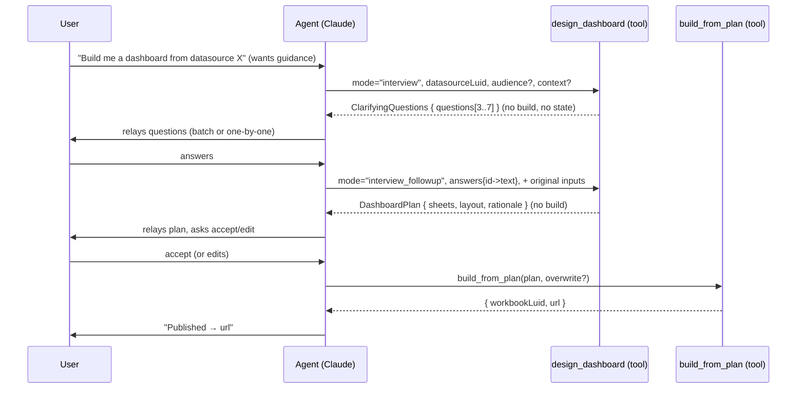
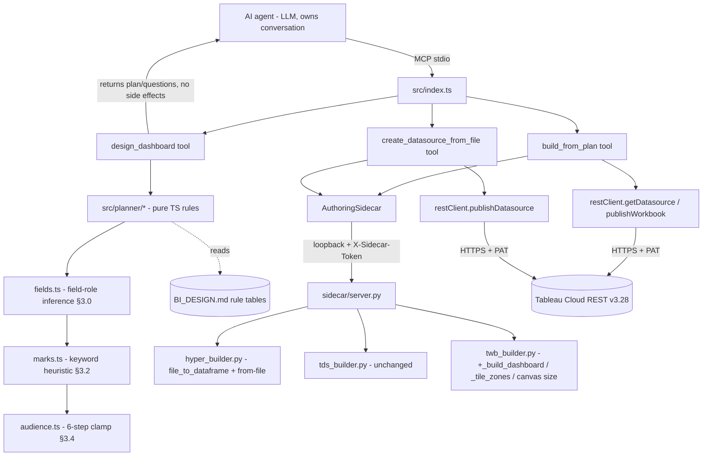

# PLAN.md — Prompt-Driven Authoring

> Implementation plan for the prompt-driven authoring feature in the **existing**
> `tableau-mcp-publish` project. Inputs: `CODEBASE.md`, `docs/feature-prompt-authoring/REQUIREMENTS.md`,
> and the live extension-point code. The root `/PLAN.md` is the read-only project baseline; this
> document is scoped to this feature only and reuses the baseline's architecture, conventions,
> guardrails, and the 46-test regression suite as a hard constraint.
>
> `docs/feature-prompt-authoring/BI_DESIGN.md` (the deterministic field-inference / chart-selection /
> audience-layout rule tables, authored after this plan by the data-engineer) is the **normative spec**
> for every planning rule referenced in §3, §5, and §6. This plan treats it as the single source of
> truth: where BI_DESIGN.md and the restated tables here ever diverge, **BI_DESIGN.md wins on every
> field/chart/audience/layout rule** and `src/planner/*` is implemented to its tables; any divergence is
> recorded in the Revision log. If BI_DESIGN.md is absent at build time, the restated tables in §3 are
> the fallback contract.

---

## 1. Problem, goal, and scope

### 1.1 Problem

The current surface (`create_starter_workbook`, `create_datasource_from_table`) is a *builder's*
interface: the caller must already know field names, mark types, row/col shelves, and must supply a
CSV. Two gaps block an *analyst's* interface:

1. **Ingest is CSV-only.** `hyper_builder.query_to_dataframe()` (line 99) handles `csv`, `snowflake`,
   `postgres` only. JSON / Parquet / Excel are rejected.
2. **Output is loose worksheets, never a dashboard.** `twb_builder.build_twb_xml()` (line 138) emits
   `<datasources>`, `<worksheets>`, `<windows>` — there is **no `<dashboards>` element** (CODEBASE.md
   Tech-Debt #3). Tableau opens the first worksheet, not an arranged dashboard.
3. **No planning layer.** Nothing translates a business question + audience into a concrete
   `sheets` + `dashboard` spec, and there is no guided "interview" path.

### 1.2 Goal

A user describes a data source (file or SQL) and a business question with an audience, optionally
guided by a senior-BI-analyst interview, and receives a **published Tableau dashboard** (worksheets
arranged on a `<dashboard>` with `<zones>`) plus a governed datasource on Cloud — in a bounded,
stateless, testable tool sequence.

### 1.3 Scope boundary (carried from REQUIREMENTS Non-goals)

In scope: multi-format file ingest; `<dashboard>` XML emission; deterministic plan generation for
3 modes × 4 audiences; bounded interview (≤2 calls); orchestration tool that builds + publishes.

Out of scope (unchanged): read/query tools; live-connection datasources; pixel-perfect render
validation (one gated live demo only); LLM inference inside the server; multi-turn server-side
conversation state; image/PDF export; map marks beyond experimental; metadata introspection;
project auto-creation.

### 1.4 The central design decision — server is deterministic + stateless; intelligence lives in the agent

The MCP server runs as a stdio subprocess. It has **no LLM client, no streaming, no session memory**
(CODEBASE.md §"BI analyst planning"). Embedding an interview loop or business-question reasoning in
the server would require either a second LLM client (cost, coupling, a new `ANTHROPIC_API_KEY`
dependency the baseline does not have) or a stateful session mechanism alien to MCP's
request/response model.

Therefore the boundary is:

| Concern | Owner | Why |
|---|---|---|
| Understanding the business question, choosing references, judging answers | **Calling agent (Claude/Cursor)** | This is LLM work; the agent already has the model. |
| Conversation history, relaying questions/answers to the user | **Calling agent** | MCP is stateless; the agent supplies full context per call. |
| Deterministic plan generation (field inference → marks → audience clamps) | **Server (TS planner)** | Predictable, unit-testable without an LLM call. |
| File authoring (`.hyper`/`.tdsx`/`.twb`) and REST publish | **Server (Python sidecar + TS REST)** | Reuses the proven baseline chain. |

Consequence (enforced by tests): every planner output is a pure function of its inputs. Given the
same `(mode, audience, businessQuestion|directions|answers, fieldHints)` it returns byte-identical
plans. This is what makes MA-1..MC-2 assertable in CI with no live model.

---

## 2. Final tool surface (overlap resolution)

REQUIREMENTS proposed five names across its body and contracts: `create_datasource_from_file`,
`design_dashboard`, `build_from_plan`, plus a `create_dashboard_workbook` / sidecar
`/workbook/dashboard`. The root brief additionally listed `create_dashboard_workbook`. These overlap.
**Resolution: three new MCP tools + one new sidecar endpoint.** `create_dashboard_workbook` is
*rejected as a public tool* — its job (build worksheets + a dashboard, then publish) is fully covered
by `build_from_plan`, and exposing both would create two ways to build a dashboard with divergent
contracts. The dashboard-building capability instead lives behind the `/workbook/dashboard` sidecar
endpoint that `build_from_plan` calls. This keeps the surface minimal and gives exactly one path to a
published dashboard.

Final state: **11 existing tools (unchanged) + 3 new tools = 14 MCP tools; 4 existing sidecar routes +
1 new route = 5 routes.**

### 2.1 `create_datasource_from_file` (new) — F-1

Single file-format-agnostic ingest entry point. `create_datasource_from_table` keeps its exact
existing signature (`csvPath` / `records`) for backward-compat (C-10); this tool is additive.

```
inputSchema (zod):
  filePath:       z.string().min(1)        // local path
  fileType:       z.enum(["csv","json","jsonl","xlsx","xls","parquet"]).optional()
                                            // inferred from extension when omitted; rejects others
  datasourceName: z.string().min(1)
  projectName:    z.string().min(1)
  overwrite:      z.boolean().default(false)
  excelSheet:     z.union([z.string(), z.number().int().nonnegative()]).optional()
  jsonPath:       z.string().optional()     // e.g. "$.data"; default = top-level array / NDJSON
outputSchema: { datasourceLuid: z.string(), url: z.string() }
```

Validation: a `.refine` derives `fileType` from the extension when omitted and **rejects any
extension not in the enum before the sidecar is called** (PA-2). The handler calls a new sidecar
route `POST /datasource/from-file`, then `resolveProjectId` + `publishDatasource` exactly as the
table tool does.

### 2.2 `design_dashboard` (new) — F-3

The planner. Always returns structured output; **never builds**. Discriminated on `mode`.

```
inputSchema (zod, discriminated union on `mode`):
  shared:
    mode:           z.enum(["autonomous","interview","interview_followup","directed"])
    datasourceLuid: z.string().min(1)           // required for autonomous/directed/interview_followup
    datasourceName: z.string().min(1)           //   "
    projectName:    z.string().min(1)
    audience:       AudienceEnum                 // required autonomous/directed; optional interview
    workbookName:   z.string().min(1).optional() // auto-derived from question when omitted
    fieldHints:     z.array(FieldHint).optional() // see §2.5 — the agent's known field list
  mode "autonomous":   businessQuestion: z.string().min(1)
  mode "interview":    context: z.string().optional(); audience optional
  mode "interview_followup":
                       answers: z.record(z.string(), z.string())   // questionId → answer
                       context: z.string().optional()
  mode "directed":     directions: z.string().min(1)

outputSchema (discriminated on `mode` in the response payload):
  mode "interview"                              → ClarifyingQuestions   (§4.1)
  mode "autonomous"|"directed"|"interview_followup" → DashboardPlan     (§4.2)
```

The `content[0].text` is the human-readable rendering the agent relays to the user (the questions, or
the plan + rationale). `structuredContent` is the machine payload the agent passes verbatim into the
next call.

### 2.3 `build_from_plan` (new) — F-5

The orchestrator/publisher. Consumes a finalized `DashboardPlan` (possibly user-edited) and produces
artifacts. This is the **only** tool that writes to Cloud in this feature.

```
inputSchema:
  plan:      DashboardPlan      // §4.2, validated by the same zod schema design_dashboard emits
  overwrite: z.boolean().default(false)
outputSchema:
  { workbookLuid: z.string(), url: z.string(), datasourceLuid: z.string().optional() }
```

Handler sequence (all-or-nothing ordering, fail-loud):
1. Re-validate `plan` against the shared zod schema (defense in depth), including the
   `schemaVersion == 1` guard (§3) and the placeholder-token rejection (§2.5).
2. If `plan.datasourceSpec` present → build + publish datasource first (reusing
   `create_datasource_from_file` / `from-query` logic), capture `datasourceLuid` (E2E-2).
3. Else `getDatasource(plan.datasourceLuid)` → if REST 404, throw **before** any file authoring (F-5.5).
4. `sidecar.buildDashboardWorkbook({...sheets, dashboardLayout, canvasWidth, canvasHeight, datasourceContentUrl, ...})`
   → `.twbx` (canvas dimensions are derived from `plan.audience`; see §3.1 and §6).
5. `resolveProjectId(plan.projectName)` → `publishWorkbook(...)` (E2E-1).
6. Return `{ workbookLuid, url, datasourceLuid? }`.

### 2.4 Why not collapse `design_dashboard` + `build_from_plan` into one tool

The two-call split is mandatory, not stylistic. MCP is synchronous request/response; the agent must
relay the plan (and, in interview mode, the questions) to the human and accept edits **before** the
expensive, side-effectful build/publish. A single tool would either publish without review or block
the protocol waiting on a human. Splitting also makes the planner a pure function (testable) and the
builder the only side-effecting tool (auditable). REQUIREMENTS F-3 makes this two-call pattern a
requirement.

### 2.5 `FieldHint` — how the planner knows what fields exist

The server does no metadata introspection (Non-goal #8); the **agent supplies the field list** it
already obtained (via the read-side `@tableau/mcp-server`). `FieldHint` is the optional carrier and is
the sole input to the §3.0 field-role inference engine:

```
FieldHint = { name: string; role?: "dimension"|"measure"; dataType?: "string"|"number"|"date"|"boolean" }
```

`role` is now optional: when omitted, the planner derives the role from §3.0 (BI_DESIGN §1) rather
than trusting a caller-supplied label. When `fieldHints` is omitted entirely, classification is
skipped and the planner emits a plan whose sheets reference placeholder field tokens (`"<measure>"`,
`"<dimension>"`) and the rationale states the agent must fill them before `build_from_plan`. This keeps
`design_dashboard` callable even with zero field knowledge and keeps the "no introspection" boundary
intact. `build_from_plan` rejects a plan that still contains placeholder tokens with a clear error
(fail-loud).

---

## 3. The planner rule pipeline (field inference → marks → clamps)

**BI_DESIGN.md is the single source of truth for every rule in this section.** The tables below
restate its rules so the milestones/tests are self-contained; where any cell here ever diverges from
BI_DESIGN.md, BI_DESIGN.md wins and `src/planner/*` is implemented to BI_DESIGN.md (the divergence is
recorded in the Revision log). The pipeline runs in a fixed order, and each stage is an isolated pure
function so it is unit-testable on its own:

```
fieldHints ─▶ §3.0 classifyFields ─▶ §3.2 markHeuristic ─▶ §3.3 chartSelect ─▶ §3.4 applyAudienceClamps ─▶ DashboardPlan
            (src/planner/fields.ts)  (src/planner/marks.ts)        (src/planner/plan.ts)   (src/planner/audience.ts)
```

`schemaVersion` guard (BI_DESIGN §0/§8.1): the planner reads BI_DESIGN's `schemaVersion` and the
incoming plan's `schemaVersion`. `src/planner/schema.ts` and `src/planner/plan.ts` **throw a clear
error if either `!= 1`** (forward-incompatible rules must fail loud, never silently mis-plan). A unit
test asserts that a non-1 version throws (§9.2).

### 3.0 Field-role inference engine — `src/planner/fields.ts` (BI_DESIGN §1) — runs BEFORE chart selection

This stage was previously missing and is the **first** step of the pipeline: chart selection in §3.3
consumes its `FieldClassification[]` output, not the raw `fieldHints`. It is a pure function of
`(name, dataType)` per `FieldHint`, mirroring BI_DESIGN §1 exactly.

**Step A — dtype primary classification (BI_DESIGN §1.1):** `number`→measure; `date`→temporal
dimension (never a measure); `boolean`→dimension (cardinality 2); `string`→dimension; absent/unknown→
dimension (conservative fallback).

**Step B — name-pattern overrides (BI_DESIGN §1.2): 8 priority-ordered regexes, applied to the
lowercased field name, first match wins, overriding Step A:**

| Priority | Regex (case-insensitive) | Role | Secondary tags |
|---|---|---|---|
| 1 | `\b(id\|_id\|uuid\|guid\|key\|pk\|fk\|code\|sku\|serial\|token\|hash)\b` | **identifier** | `high_cardinality`, **`suppress`** |
| 2 | `\b(date\|day\|month\|quarter\|year\|week\|timestamp\|time\|period\|fiscal\|fy\|cy)\b` | **temporal** | `temporal` |
| 3 | `\b(lat\|latitude\|lon\|longitude\|lng)\b` | **geographic** | `geo_coordinate` |
| 4 | `\b(country\|nation\|state\|province\|region\|city\|city_name\|metro\|zip\|postal\|postcode\|geoid\|territory)\b` | **geographic** | `geo_named` |
| 5 | `\b(name\|label\|title\|description\|desc\|category\|cat\|type\|status\|stage\|segment\|group\|tier\|bucket\|channel\|source\|medium\|campaign)\b` | **dimension** | `low_cardinality` |
| 6 | `\b(flag\|is_\|has_\|can_\|should_\|active\|enabled\|deleted\|archived\|approved\|published)\b` | **dimension** | `boolean_flag` (cardinality 2) |
| 7 | `\b(revenue\|sales\|amount\|total\|sum\|gross\|net\|profit\|margin\|cost\|price\|spend\|budget\|...\|value)\b` (full list = BI_DESIGN §1.2 row 7) | **measure** | `numeric` (SUM) |
| 8 | `\b(rank\|ranking\|position\|priority\|order\|index\|sequence)\b` | **dimension** | `ordinal` |
| — | no match | fall back to Step A dtype role | — |

**Step C — cardinality heuristic (BI_DESIGN §1.3):** `high_cardinality` when tagged `identifier` or
the name matches `\b(name|email|url|path|description)\b`; `low_cardinality` when tagged `boolean_flag`
or the name matches `\b(status|stage|type|tier|channel|segment|region|country|state)\b`; otherwise
`unknown` (assume low for selection, note in rationale).

**Step D — tie-breakers (BI_DESIGN §1.4):** numeric dtype **and** identifier-name → **identifier wins**
(a numeric ID is not a measure); string dtype **and** measure-name → place on `measures` and annotate
"string-typed measure — verify aggregation in Tableau."

**Output (BI_DESIGN §1.5):**
```
FieldClassification = {
  name:            string,
  role:            "measure" | "dimension" | "identifier" | "temporal" | "geographic",
  tags:            string[],                    // secondary tags from Steps B/C
  cardinalityHint: "low" | "high" | "unknown",
  suppress:        boolean                      // true for identifiers (§1.5)
}
```

**Suppression is load-bearing (BI_DESIGN §1.5):** fields with `suppress=true` are **never** placed on
Rows/Cols/Color/measures — they are removed from the usable set before §3.3 runs. This is what keeps
`order_id` / `customer_id` off the shelves in the §5 worked examples. When `fieldHints` is omitted,
classification is skipped and the planner emits placeholder tokens (§2.5) instead.

### 3.1 Audience → layout/density constraints (BI_DESIGN §3.1 master table + §4.1 canvas)

All values are deterministic functions of `audience`. The `maxMeasures`/`maxDimensions` columns are
enforced by clamp STEP 5 (§3.4); `mapAllowed` drives STEP 6; the canvas columns are emitted into the
dashboard `<size>` (§3 → §6). This restates BI_DESIGN §3.1 + §4.1.

| audience | maxSheets | defaultLayout | allowedMarkTypes | mapAllowed | minimumKpiCount | maxMeasures/sheet | maxDimensions/sheet | canvas W×H |
|---|---|---|---|---|---|---|---|---|
| `exec` | 3 | `tiled_vertical` | bar, line, text | No | **1** (text, index 0) | **1** | **1** | **1000×800** |
| `analyst` | 8 | `tiled_horizontal` | bar, line, text (scatter→bar, G-02) | Yes (G-05 warn) | **0** | **4** | **3** | **1200×900** |
| `operational` | 6 | `tiled_vertical` (forced) | text, bar, line | No | **1** (text, index 0) | **2** | **1** | **800×1200** |
| `mixed` | 6 | `tiled_vertical` | bar, line, text | No | **0** | **2** | **2** | **1000×900** |

### 3.2 Keyword → mark-type heuristic — `src/planner/marks.ts` (BI_DESIGN §6, normative)

Applied per clause after splitting `businessQuestion` / `directions` on `\s+and\s+`, `,`, or `;`.
**Lower priority number wins** when two rows match the same clause; first match wins per clause; each
clause may yield a sheet. This restates BI_DESIGN §6 exactly (the previous 5-row inline table was the
divergent fallback and is replaced).

| Priority | Regex (case-insensitive, per clause) | `markType` | shelf placement |
|---|---|---|---|
| 1 | `\b(top\s+\d+\|list\|table\|detail\|breakdown\|show me all\|all records)\b` | `text` | first usable dim on `rows`; first usable measure on `measures` |
| 2 | `\b(trend\|over time\|by (month\|quarter\|year\|date\|day\|week\|period)\|growth\|historical\|time series\|trajectory)\b` | `line` | first temporal dim on `cols`; first measure on `measures` |
| 3 | `\b(kpi\|headline\|total\|grand total\|overall\|how many\|count of\|sum of\|single number\|big number)\b` | `text` (KPI) | no dim; first measure on `measures` |
| 4 | `\b(compare\|comparison\|versus\|vs\.?\|by (region\|category\|segment\|...\|group)\|across\|per\|distribution\|breakdown by\|rank)\b` | `bar` | first usable non-temporal dim on `cols`; first measure on `measures` |
| 5 | `\b(map\|geography\|geographic\|location\|where\|by country\|by state\|by city\|spatial)\b` | `map` | first geo dim on `rows`; first measure on `measures` |
| 6 | `\b(correlation\|scatter\|relationship between\|drives\|impact of\|x vs y\|plotted against)\b` | `bar` (scatter→bar, G-02) | first usable dim on `cols`; first measure on `measures` |
| 7 | `\b(share\|proportion\|composition\|part.?to.?whole\|percentage of)\b` | `bar` (stacked annotation) | first usable dim on `cols`; all usable measures on `measures` |
| — | no match | `bar` | first usable non-temporal dim on `cols`; first usable measure on `measures` |

**No-dimension downgrade (BI_DESIGN §6 final clause):** if the heuristic selected `bar` or `line` but
**no usable dimension exists** (all suppressed or absent), downgrade the sheet to `text` (KPI) and note
it in `rationale`. **KPI-without-measure drop (invariant §0.2):** a resulting `text` mark that has **no
`measures` entry** is a label only and is **dropped** from the plan (the builder's `text` encoding
needs a measure to render). These two rules are unit-tested in §9.2 (no-dimension downgrade test).

### 3.3 Chart selection from the classified field set (BI_DESIGN §2)

Chart selection consumes the §3.0 `FieldClassification[]` (suppressed fields already removed) plus the
per-clause `markType` from §3.2, then resolves shelves per BI_DESIGN §2.2 and applies the §2.3 builder
gaps. The `markType` enum is `{bar,line,text,map}`, matching `_MARK_CLASS` exactly — scatter, treemap,
color, reference-line, and top-N are **not** builder features, so the shapes that imply them fall back
per the gap register and **carry their specific `rationale` annotation** (asserted — see §3.5, §9.2):

| Gap | Trigger shape | Fallback | Required `rationale` annotation |
|---|---|---|---|
| G-01 | multi-series / segmented (C-02, C-09) | drop color dim | "Color encoding not yet supported by the builder; apply color manually in Tableau." |
| G-02 | 2 measures (C-05 scatter) / "drives"/"correlation" clause | `markType:"bar"` | "Scatter plot requested; rendered as bar until builder adds Circle mark class." |
| G-03 | part-to-whole, >2 measures (treemap) | `markType:"bar"` (stacked) | "Treemap not supported; rendered as bar." |
| G-04 | analyst reference/target line | — | "Add reference lines manually in Tableau." |
| G-05 | high-cardinality dimension (C-04) | place dim normally | "High-cardinality dimension — apply Top 10 filter in Tableau Desktop: right-click field > Filter > Top > By field." |

### 3.4 Audience clamp algorithm — `src/planner/audience.ts` (BI_DESIGN §3.2, **verbatim 6 steps**)

Applied after §3.3 generates the raw sheet list. Steps run in the listed order; **each step is an
independently unit-tested pure function** restating BI_DESIGN §3.2 step-for-step (the previous 5-clamp
list was under-specified — it omitted STEP 5 per-sheet caps and STEP 6 map guard, both now restored):

```
function applyAudienceClamps(sheets, audience):

  STEP 1 — TRUNCATE
    If sheets.length > maxSheets[audience]:
      Remove sheets from the TAIL until length == maxSheets[audience].
      Note in rationale: "Truncated N sheets to fit audience limit."

  STEP 2 — DROP DISALLOWED MARK TYPES
    For each sheet where markType not in allowedMarkTypes[audience]:
      Replace with the audience default:
        exec/operational → "text" for 0-dimension sheets, "bar" otherwise
        analyst/mixed    → "bar"
      Append to sheet.rationale: "Mark type replaced to comply with audience constraints."

  STEP 3 — ENSURE KPI LEAD
    If minimumKpiCount[audience] > 0 AND no sheet with markType=="text" at index 0:
      Insert a KPI text sheet at index 0 (first measure from the field list).
      If insertion exceeds maxSheets[audience], drop the last sheet to make room.

  STEP 4 — ENFORCE LAYOUT
    If audience == "operational": force dashboardLayout = "tiled_vertical" (override not allowed).
    Else: use defaultLayout[audience] unless the caller's directions explicitly set a layout.

  STEP 5 — CAP MEASURES AND DIMENSIONS PER SHEET
    For each sheet:
      If measures.length > maxMeasures[audience]:
        Truncate to maxMeasures[audience]; note in sheet.rationale.
      If (cols.length + rows.length) > maxDimensions[audience]:
        Truncate dimensions to maxDimensions[audience] (keep cols first); note in sheet.rationale.

  STEP 6 — MAP MARK GUARD
    If audience in {"exec", "operational", "mixed"}:
      For each sheet where markType == "map":
        Replace with "bar"; note in sheet.rationale: "Map mark not allowed for this audience."

  RETURN clamped sheets + dashboardLayout
```

These six steps each map to a unit-testable predicate (BI_DESIGN §8.2) and satisfy MA-1, MA-2, MA-3.
STEP 5 (per-sheet measure/dimension caps) and STEP 6 (map guard) each get their own unit tests (§9.2).

### 3.5 Gap-fallback annotations are produced and asserted (BI_DESIGN §2.3 / §4.4)

Per BI_DESIGN's rule "any plan that relies on a gap feature must include the fallback **and** the
`rationale` annotation," the planner attaches the exact §3.3 annotation string to the affected
`SheetSpec.rationale` whenever it applies a fallback, and `build_from_plan` preserves it (it does not
block on gap features; it builds the fallback silently and keeps the annotation). This generation is
verified by directed unit tests in §9.2: a 2-measure analyst shape carries the G-02 scatter-fallback
note in `sheet.rationale`; a high-cardinality dimension carries the G-05 top-N note. Layout gaps L-01
(analyst > 4 sheets → `tiled_vertical`) and L-02 (floating) are annotated the same way.

### 3.6 Interview question bank (deterministic templates) — F-3.4..F-3.7 (BI_DESIGN §7)

`mode: "interview"` returns 3–7 questions selected from the fixed, ordered bank in BI_DESIGN §7 by
which inputs are still unknown (audience missing → `q_audience`; no `fieldHints` → `q_key_metric`;
etc.). Selection is deterministic given the inputs, so MB-1 (count 3–7, no `sheets` key) is assertable.
If fewer than 3 questions would otherwise be selected, BI_DESIGN §7 mandates the unconditional minimums
`q_goal`, `q_key_metric`, `q_filters`. Each question: `{ id, question, hint? }`. `interview_followup`
maps `answers[id]` back to the same fields the autonomous path consumes, then runs the identical
field-inference → mark → clamp pipeline → MB-2 yields a `DashboardPlan` with non-empty `rationale`.

---

## 4. The `DashboardPlan` contract (the lynchpin)

This is the explicit, versioned contract between the planner (`design_dashboard`) and the builder
(`build_from_plan` → sidecar). It is one zod schema defined once in `src/planner/schema.ts`, imported
by both tools, and structurally mirrored by a Pydantic model on the sidecar boundary. Defining it in a
single module is what keeps producer and consumer from drifting.

### 4.1 `ClarifyingQuestions`

```
ClarifyingQuestions = {
  schemaVersion: 1,
  kind: "questions",
  questions: Array<{ id: string; question: string; hint?: string }>   // length 3..7
}
```

### 4.2 `DashboardPlan`

```
DashboardPlan = {
  schemaVersion:   1,                        // §3 guard: schema/planner throw if != 1
  kind:            "plan",
  workbookName:    string,
  datasourceLuid:  string,
  datasourceName:  string,
  projectName:     string,
  audience:        "exec" | "analyst" | "operational" | "mixed",
  rationale:       string,                  // non-empty; cites how the plan answers the question
  dashboardLayout: "tiled_vertical" | "tiled_horizontal",
  sheets:          SheetSpec[],             // length 1..maxSheets[audience]
  datasourceSpec?: DatasourceSpec           // present only when a NEW datasource must be built
}

SheetSpec = {                               // superset of the existing src/sidecar.ts SheetSpec
  title:     string,
  markType:  "bar" | "line" | "text" | "map",
  rows:      string[],                      // field names (or placeholder tokens until filled)
  cols:      string[],
  measures:  string[],                      // SUM-aggregated, matching existing twb_builder semantics
  rationale?: string                        // which clause this sheet answers + any gap annotation (§3.5)
}

DatasourceSpec = {
  datasourceName: string,
  filePath?:   string,                      // file path → /datasource/from-file
  fileType?:   "csv"|"json"|"jsonl"|"xlsx"|"xls"|"parquet",
  excelSheet?: string | number,
  jsonPath?:   string,
  sql?:        string,                      // query path → /datasource/from-query
  connection?: Record<string, unknown>      // matches existing QueryArgs.connection
}
```

Invariants (enforced by zod `.refine`, fail-loud):
- `schemaVersion == 1`; the schema and planner throw on any other value (BI_DESIGN §0/§8.1).
- Exactly one of `datasourceSpec` xor a resolvable `datasourceLuid` is required for `build_from_plan`.
- Within `datasourceSpec`, exactly one of (`filePath`) xor (`sql` + `connection`) is set.
- `sheets.length` ≥ 1 and ≤ `maxSheets[audience]`; `rationale` non-empty; no placeholder tokens at
  build time.
- `markType` values respect the audience allow-list; `measures.length ≤ maxMeasures[audience]` and
  `cols.length + rows.length ≤ maxDimensions[audience]` per sheet (validated again at build time as
  defense in depth, mirroring clamp STEP 5).
- A `text` mark has ≥1 `measures` entry (invariant §0.2 — a measureless KPI is dropped, never built).

`SheetSpec` is a strict superset of the existing `src/sidecar.ts` `SheetSpec` and the sidecar's
`SheetModel`, so the existing `/workbook/starter` path and its 5 twb tests are untouched.

---

## 5. The MCP interaction contract for interview mode

Stateless and bounded to **at most two `design_dashboard` calls** before a plan exists (F-3.7).



Contract rules:
- The server stores **nothing** between calls. Question IDs are stable, content-derived strings (e.g.
  `q_audience`, `q_key_metric`) so the agent can map answers without server-held state.
- The follow-up call carries the *full* original input set plus `answers`; the server reconstructs the
  same plan it would have produced autonomously, with answers overriding defaults.
- Autonomous and directed modes skip the questions hop entirely (one call → plan).
- Hard ceiling: two planner calls. There is no third "refine" call in this feature; further edits are
  the agent mutating the plan object locally and calling `build_from_plan`.

---

## 6. Sidecar dashboard XML

### 6.1 Functions to extend in `sidecar/twb_builder.py`

Exactly the three named in CODEBASE.md §"Dashboard workbook authoring":

1. **`build_twb_xml()`** (line 138): add optional params `dashboards: list[dict] | None = None`,
   `dashboard_layout: str = "tiled_vertical"`, `canvas_width: int = 1000`, and
   `canvas_height: int = 800`. After the existing `<windows>` block is built, if `dashboards` is
   provided, call `_build_dashboard(...)` (passing the canvas dimensions into the emitted `<size>`) and
   append its `<dashboards>` element to the `workbook` root. **Defaults (`None` + 1000×800) ⇒
   byte-identical output to today** when no dashboard is requested, so the 5 existing twb tests pass
   unchanged (regression guard).
2. **`_build_dashboard()`** (new helper): accepts the dashboard name, the layout direction, the
   ordered list of worksheet titles, and **`canvas_width` / `canvas_height`**, and returns the
   `<dashboards><dashboard>…</dashboard></dashboards>` `ET.Element` whose `<size>` carries the supplied
   dimensions (no longer hardcoded — see §6.2).
3. **`build_starter_twbx()`** (line 223): add the same four optional params and forward them to
   `build_twb_xml()`. (`build_dashboard_twbx()` is *not* a new public function — the dashboard path
   reuses `build_starter_twbx` with `dashboards` populated, keeping one zip/writer code path.)

### 6.2 The `<dashboard>` structure to emit

Zones reference worksheets by the worksheet's `name` attribute (the sheet `title`). Tableau zone
coordinates use a 0–100000 grid. The `<size>` element carries the **audience-derived** canvas
dimensions (`canvas_width` × `canvas_height` from §3.1 / BI_DESIGN §4.1) — it is no longer hardcoded to
1000×800. The dashboard is the default open tab via a `<window class="dashboard">` entry appended to
`<windows>`. The example below shows the `analyst` canvas (1200×900):

```xml
<dashboards>
  <dashboard name="Dashboard 1">
    <size maxheight="900" maxwidth="1200" minheight="900" minwidth="1200" />   <!-- = canvas_height × canvas_width -->
    <zones>
      <zone h="100000" id="1" type="layout-basic" w="100000" x="0" y="0">
        <!-- one child <zone type="worksheet"> per sheet, name = worksheet title -->
        <zone h="50000" id="2" name="Revenue by Region" type="worksheet" w="100000" x="0" y="0" />
        <zone h="50000" id="3" name="Top 10 Customers"  type="worksheet" w="100000" x="0" y="50000" />
      </zone>
    </zones>
  </dashboard>
</dashboards>
```

The four audience sizes (BI_DESIGN §4.1): exec 1000×800, analyst 1200×900, operational 800×1200,
mixed 1000×900. A pytest asserts the emitted `<size>` `maxwidth`/`maxheight` match the audience passed
through the request (§9.1).

### 6.3 Zone tiling math (the geometry helper)

A single pure helper `_tile_zones(titles, layout)` returns the `(x, y, w, h)` quad per worksheet. The
math is the main correctness risk (zone overlap), so it is isolated and unit-tested independently
(DB-2). It is independent of the canvas pixel size — zones always use the 0–100000 grid:

- Grid = 100000 × 100000. `n = len(titles)`.
- `tiled_vertical`: each zone `w = 100000`, `h = floor(100000/n)`, `x = 0`,
  `y = i * floor(100000/n)`. The **last** zone absorbs the rounding remainder so `Σh == 100000`
  exactly (no gap/overlap). → distinct `y`, equal `x` (satisfies DB-2).
- `tiled_horizontal`: symmetric on the x-axis: `h = 100000`, `w = floor(100000/n)`, `y = 0`,
  `x = i * floor(100000/n)`, last zone absorbs remainder. → distinct `x`, equal `y`.
- IDs: container zone `id=1`; worksheet zones `id=2..n+1`. Names are the worksheet titles verbatim.

### 6.4 Sidecar API boundary (`sidecar/server.py`)

New route `POST /workbook/dashboard` with a `DashboardWorkbookRequest` model = `WorkbookRequest` +
`dashboard_layout: str = Field(default="tiled_vertical", alias="dashboardLayout")` +
`canvas_width: int = Field(default=1000, alias="canvasWidth")` +
`canvas_height: int = Field(default=800, alias="canvasHeight")`. `dashboard_layout` is validated
against `{"tiled_vertical","tiled_horizontal"}` (400 otherwise); `canvas_width`/`canvas_height` are
validated as positive ints (400 otherwise). The route builds the dashboard list from the sheet titles
and forwards to
`build_starter_twbx(..., dashboards=[...], dashboard_layout=..., canvas_width=..., canvas_height=...)`.
The TS caller (`build_from_plan` → `sidecar.buildDashboardWorkbook`) derives `canvasWidth`/
`canvasHeight` from `plan.audience` via the §3.1 table before the call. The existing `/workbook/starter`
route is untouched.

New route `POST /datasource/from-file` with a `FileRequest` model: `name`, `file_path`, `file_type?`,
`excel_sheet?`, `json_path?`. It dispatches into `query_to_dataframe` after `hyper_builder` gains
format branches (§6.5).

### 6.5 Multi-format ingest in `hyper_builder.py`

Extend `query_to_dataframe()` connection dispatch (line 99) with new branches, plus a thin
`file_to_dataframe(file_type, path, excel_sheet, json_path)` dispatcher so format logic is one place:

| fileType | pandas call | notes |
|---|---|---|
| `csv` | `pd.read_csv` | unchanged path |
| `json` | `pd.read_json(path)` then optional `jsonPath` selection | array or object-with-array |
| `jsonl` | `pd.read_json(path, lines=True)` | NDJSON |
| `xlsx` / `xls` | `pd.read_excel(path, sheet_name=excel_sheet or 0)` | `openpyxl` engine (C-4) |
| `parquet` | `pd.read_parquet(path)` | `pyarrow` already present (C-5) |

`jsonPath` MVP supports a leading `$.<key>` single-level selector (documented limit); anything deeper
is rejected with a clear error rather than silently mis-parsing. Unknown `file_type` → `ValueError`
(surfaced as 400). `openpyxl` is added to `sidecar/pyproject.toml` as a non-optional dep (C-4).

---

## 7. Component & data flow



### Trust boundaries (unchanged from baseline, extended)
- **Agent ↔ server:** stdio JSON-RPC; sidecar stdout never reaches the channel.
- **TS ↔ sidecar:** `127.0.0.1` only + per-spawn `X-Sidecar-Token` (`hmac.compare_digest`). New
  routes inherit the existing `token_guard` middleware automatically (C-2).
- **server ↔ Cloud:** PAT in sign-in body only, never logged; explicit-project guardrail
  (`resolveProjectId` rejects empty/Default) applies to every new publish.
- **Boundary preserved:** all REST + auth stays in TS; all file authoring stays in Python. The TS
  planner (`fields.ts`/`marks.ts`/`audience.ts`/`plan.ts`) produces only structural plans (no network),
  so it does not cross the boundary.

---

## 8. Build sequence (dependency-ordered, each slice independently buildable + testable)

The thinnest runnable slice first; each milestone leaves `make ci` green and adds its own tests.

**M0 — Pre-flight (regression baseline).**
Fix the `.cursor/**` lint-ignore gap (CODEBASE.md Tech-Debt #1, one line in `eslint.config.js`) so
`make ci` is green locally before the feature branch. Confirm the 46 existing tests pass. No feature
code. *Done when:* `make ci` green on the clean tree.

**M1 — Multi-format ingest (Python-only, no new tool yet).** ← thinnest vertical slice
`hyper_builder.file_to_dataframe()` + branches; add `openpyxl` dep; new `/datasource/from-file`
sidecar route + `FileRequest` model. *Tests:* PA-1 (parquet/xlsx/json/jsonl fixtures round-trip),
PA-3 (excel sheet by index + name). *Done when:* new pytest green, `mypy --strict` clean, all 18
prior Python tests pass.

**M2 — `create_datasource_from_file` MCP tool.**
`src/tools/createDatasourceFromFile.ts` + `sidecar.ts` `buildDatasourceFromFile()` + register in
`index.ts`. *Tests:* PA-2 (unsupported extension → zod error, zero sidecar calls), wiring test
(correct sidecar route + publish call), 12-tool registration count. *Done when:* new vitest green,
existing 28 pass (registration count updated 11→12).

**M3 — Dashboard XML in the sidecar (Python-only).**
`twb_builder._tile_zones()`, `_build_dashboard()` (with audience canvas size), extend `build_twb_xml` /
`build_starter_twbx` with optional `dashboards`/`dashboard_layout`/`canvas_width`/`canvas_height`; new
`/workbook/dashboard` route + `DashboardWorkbookRequest` (incl. `canvasWidth`/`canvasHeight`). *Tests:*
DB-1 (one `<zone type="worksheet">` per sheet), DB-2 (vertical distinct-y/equal-x; horizontal
distinct-x/equal-y; Σ covers grid, no overlap), **canvas-size test** (emitted `<size>` matches the
audience: exec 1000×800, analyst 1200×900, operational 800×1200, mixed 1000×900), default-`None`
regression (5 twb tests unchanged). *Done when:* new pytest green, mypy clean.

**M4 — Field inference + `DashboardPlan` schema + planner rules (TS-only, pure).**
`src/planner/fields.ts` (the §3.0 field-role inference engine: dtype classification, the 8 priority
regexes, cardinality heuristic, tie-breakers, `FieldClassification` with `suppress`) — built **first**
because every later stage consumes it; `src/planner/schema.ts` (zod for `DashboardPlan` /
`ClarifyingQuestions` / `SheetSpec` / `DatasourceSpec`, incl. the `schemaVersion == 1` guard);
`src/planner/marks.ts` (BI_DESIGN §6 keyword heuristic + no-dimension downgrade);
`src/planner/audience.ts` (the 6-step clamp); `src/planner/questions.ts` (interview bank);
`src/planner/plan.ts` (generator wiring fields→marks→chart-select→clamps, applies gap annotations,
reads BI_DESIGN tables, enforces the `schemaVersion` guard). No tool yet. *Tests:* **field-inference
units (identifier-suppression: numeric `customer_id` → role `identifier`, `suppress=true`, never on a
shelf; measure/dimension classification per BI_DESIGN §8 predicates)**, audience-clamp unit tests
(incl. STEP 5 per-sheet caps and STEP 6 map guard), no-dimension downgrade, mark-heuristic units,
gap-annotation units (G-02 scatter→bar note; G-05 top-N note), `schemaVersion != 1` throws, schema
round-trip. *Done when:* planner functions unit-tested, build clean.

**M5 — `design_dashboard` tool.**
`src/tools/designDashboard.ts` wires modes to the planner; register in `index.ts`. *Tests:* MA-1..3,
MB-1..2, MC-1..2 (the exact fixtures in REQUIREMENTS; MC-1 pins `audience:"analyst"` — see §9.2),
13-tool registration count. *Done when:* all mode tests green.

**M6 — `build_from_plan` tool (orchestration + publish).**
`src/tools/buildFromPlan.ts` + `sidecar.ts` `buildDashboardWorkbook()` (derives `canvasWidth`/
`canvasHeight` from `plan.audience`); placeholder-token rejection; `schemaVersion` re-validation;
datasource-first ordering. *Tests:* E2E-1 (one sidecar `/workbook/dashboard`, one `publishWorkbook`,
no `publishDatasource` when no spec), E2E-2 (`datasourceSpec.filePath` → file build first +
`datasourceLuid` in result), DB-3 (mocked sidecar response → valid plan flows through), 14-tool
registration count. *Done when:* orchestration tests green.

**M7 — CI matrix + docs + gated live demo.**
Update CI to run the new tests on Node 22/24/26 + Python 3.12/3.13 (CI-1, CI-2). Add
`scripts/demo-dashboard.ts` and `npm run demo:dashboard`. Run the one authorized live publish; capture
the dashboard-tab screenshot in `ACCEPTANCE.md` (E2E-3). *Done when:* CI green across matrix; demo
artifact captured.

Dependency edges: M1→M2, M3→M6, M4→M5→M6, all→M7. Within M4, `fields.ts` precedes `marks.ts` and
`plan.ts`. M1/M3 (Python) and M4 (TS planner) can proceed in parallel after M0.

---

## 9. Test strategy (mapped to REQUIREMENTS success-criteria IDs)

Target: ≥24 new TS tests + ≥13 new Python tests, on top of the 46 that must stay green.

### 9.1 Headless Python — structural `.twb` / `.tdsx` assertions
| Test | Asserts | Criterion |
|---|---|---|
| `test_hyper_builder` parquet/xlsx/json/jsonl fixtures | round-trip row count + types; one `<column>` per source col after tdsx | PA-1 |
| excel sheet by index `1` and name `"Sheet2"` | correct sheet row count | PA-3 |
| `test_twb_builder` dashboard | parse `.twb`; `<dashboard>` present; `<zone type="worksheet">` count == len(sheets) | DB-1 |
| zone geometry | vertical: distinct `y`, equal `x`; horizontal: distinct `x`, equal `y`; no overlap, full coverage | DB-2 |
| **canvas size per audience** | emitted `<size>` `maxwidth`/`maxheight` == exec 1000×800, analyst 1200×900, operational 800×1200, mixed 1000×900 | §3.1/§4.1, DB-1 |
| default-None regression | `build_twb_xml` with no `dashboards` (defaults 1000×800) == today's output | regression |
| `test_server` new routes | `/workbook/dashboard` (+ `canvasWidth`/`canvasHeight`) → valid `.twbx`; `/datasource/from-file` → valid `.tdsx`; token guard still applies | DB-1, PA-1 |

### 9.2 Headless TS — planner unit tests + mocked orchestration
| Test | Asserts | Criterion |
|---|---|---|
| **field inference — identifier suppression** | numeric/string `customer_id`, `order_id` → role `"identifier"`, `suppress==true`; never appears in any sheet's `cols`/`rows`/`measures` | §3.0, BI_DESIGN §8 |
| **field inference — measure vs dimension** | `revenue`(number)→measure; `region`(string)→dimension(low_card); `order_date`(date)→temporal; `is_active`→boolean_flag dimension | §3.0, BI_DESIGN §8 |
| **schemaVersion guard** | `DashboardPlan`/BI_DESIGN with `schemaVersion != 1` → planner throws | §3, BI_DESIGN §0/§8.1 |
| autonomous exec | `sheets.length ≤ 3`, all `markType ∈ {bar,line,text}`, `sheets[0].markType=="text"` (KPI lead) | MA-1 |
| autonomous analyst | `sheets.length ≤ 8` | MA-2 |
| autonomous operational | `dashboardLayout == "tiled_vertical"` and ≥1 `markType=="text"` | MA-3 |
| **clamp STEP 5 — per-sheet caps** | exec sheet with 3 measures → truncated to 1 (`maxMeasures`); analyst sheet with 5 dims → `cols+rows ≤ 3` | §3.4 STEP 5, BI_DESIGN §8 |
| **clamp STEP 6 — map guard** | a `map` sheet under exec/operational/mixed → `markType=="bar"` + "Map mark not allowed" note; survives under analyst | §3.4 STEP 6 |
| **no-dimension downgrade** | `bar`-selected shape with all dimensions suppressed → `markType=="text"` (KPI) with downgrade note; measureless `text` is dropped | §3.2, BI_DESIGN §0.2/§6 |
| **gap annotation — scatter→bar** | 2-measure analyst shape → `markType=="bar"` with the G-02 scatter-fallback note in `sheet.rationale` | §3.5, G-02 |
| **gap annotation — top-N** | high-cardinality dimension → `markType=="bar"` with the G-05 top-N note in `sheet.rationale` | §3.5, G-05 |
| interview | `questions.length ∈ [3,7]`, no `sheets` key | MB-1 |
| interview_followup | returns `DashboardPlan`, `rationale` non-empty | MB-2 |
| directed (exact string, `audience:"analyst"`) | exactly 2 sheets: `sheets[0].markType=="text"`, `sheets[1].markType=="bar"` (analyst has `minimumKpiCount==0`, so the clamp inserts no extra KPI and the `[text, bar]` pair survives) | MC-1 |
| directed missing `directions` | zod validation error | MC-2 |
| from-file unsupported ext | thrown error, **zero** sidecar calls (spy count 0) | PA-2 |
| build_from_plan no spec | 1× sidecar `/workbook/dashboard`, 1× `publishWorkbook`, 0× `publishDatasource`; request carries audience-derived `canvasWidth`/`canvasHeight` | E2E-1 |
| build_from_plan with file spec | file build first, `datasourceLuid` in result | E2E-2 |
| build_from_plan twbx shape | mocked sidecar response → `.twb` has `<workbook>/<datasources>/<worksheets>/<dashboard>` | DB-3 |
| registration counts | 12 → 13 → 14 as tools land | regression |

Orchestration tests reuse the existing `FakeServer` + `vi.fn()` ctx pattern from `tests/tools.test.ts`
(mock `rest` + `sidecar`); no live REST, no PAT in CI.

**MC-1 audience pinning (defect fix):** the MC-1 directed fixture
(`"show me a table of top 10 customers by revenue and a bar chart of revenue by region"`) is run with
`audience:"analyst"`. Analyst's `minimumKpiCount == 0`, so clamp STEP 3 inserts **no** leading KPI
sheet, and the heuristic's `[text (top-10 table), bar (by region)]` two-sheet result survives the
pipeline unchanged — matching BI_DESIGN §8.2's MC-1 predicate (`sheets.length == 2`,
`sheets[0].markType == "text"`, `sheets[1].markType == "bar"`). Running it under `exec` (where
`minimumKpiCount == 1`) would inject a third KPI sheet and break the expected result, which is why the
audience is pinned.

### 9.3 Gated live demo
`npm run demo:dashboard`: `design_dashboard(autonomous) → build_from_plan` against the Dev site;
verify the Cloud URL resolves to a workbook with ≥1 dashboard tab; screenshot → `ACCEPTANCE.md`
(E2E-3). This is the only non-headless check, matching the baseline's criterion-7 policy.

### 9.4 CI
Extend the matrix legs and add the new test files to both jobs (CI-1); `npm run build` + `npm run lint`
+ `ruff` + `mypy --strict` clean after the new modules (CI-2).

---

## 10. Risks & mitigations

| # | Risk | Severity | Mitigation |
|---|---|---|---|
| R-1 | **Tableau dashboard XML fidelity** — a hand-built `<dashboard>` that parses but won't render in Cloud. | High | Reuse the proven `TWB_VERSION="18.1"` / `SOURCE_BUILD="2024.1.0"` (C-9). Match the exact zone structure in CODEBASE.md §"Dashboard workbook authoring". Structural pytest (DB-1/DB-2/canvas-size) for shape; one gated live render (E2E-3) for ground truth, identical to how the baseline validated worksheets. |
| R-2 | **Zone overlap / sizing math** — rounding gaps or overlapping tiles. | High | Isolate `_tile_zones()` as a pure helper; last-zone-absorbs-remainder so `Σ == 100000` exactly; DB-2 asserts distinct offsets, equal cross-axis, full coverage, zero overlap. Canvas pixel size is decoupled from the 0–100000 zone grid, so audience sizing cannot perturb tiling. |
| R-3 | **Multi-format type mapping** — wrong dtype inference (e.g. JSON ints as float, Excel dates as strings). | Medium | pantab infers Hyper types from pandas dtypes (existing, proven). PA-1 round-trips each format and asserts column types; PA-3 covers Excel sheet selection. `jsonPath` limited to one documented level, else explicit error. |
| R-4 | **Backward-compat regression** — breaking any of the 11 tools / 46 tests. | High | Every change is additive: optional sidecar params default to today's behavior (`dashboards=None`, canvas 1000×800 ⇒ byte-identical); `create_datasource_from_table` signature frozen (C-10); `/workbook/starter` untouched; `SheetSpec` is a strict superset. Registration-count tests track 11→14 explicitly. M0 restores green CI before any feature code. |
| R-5 | **Planner ↔ builder contract drift** — `DashboardPlan` shape diverging between producer and consumer. | Medium | One zod schema in `src/planner/schema.ts` imported by both tools; one mirrored Pydantic model; `build_from_plan` re-validates the plan it receives incl. the `schemaVersion` and per-sheet-cap invariants (defense in depth). |
| R-6 | **Non-determinism leaks into the planner** — making MA-/MC- tests flaky. | Medium | No `Date.now()`, no RNG, no model calls in `src/planner/*`; field inference, mark heuristic, and clamps are pure functions of inputs; question IDs are content-derived constants; tests use the exact fixture strings from REQUIREMENTS. |
| R-7 | **Placeholder fields reaching Cloud** — a plan with `<measure>` tokens published as broken viz. | Medium | `build_from_plan` rejects any plan still containing placeholder tokens with a clear, actionable error before authoring (fail-loud). |
| R-8 | **`openpyxl` / `pyarrow` availability** in CI venv. | Low | `openpyxl` added as non-optional dep (C-4); `pyarrow` already present via pantab (C-5); CI-2 fails loudly if missing. |
| R-9 | **Secret/PAT leakage via new file paths or error text.** | High | No new auth surface (C-1). New tools route through existing `restClient` (PAT only in sign-in body). Error messages echo field paths, never values; extend the `secrets.test.ts` log-capture assertion to the new tools. |
| R-10 | **PLAN ↔ BI_DESIGN rule drift** — restated tables in §3 falling out of sync with the normative spec. | Medium | BI_DESIGN.md is declared normative in the header and §3; the planner is implemented to BI_DESIGN, not to the restated cells; BI_DESIGN §8.2 predicates are the test oracle, so any drift fails a unit test rather than shipping. |

---

## 11. Security, observability, testing — designed in

- **Security:** no new auth or secret surface (C-1); loopback + token reused for new routes (C-2);
  input validated at every boundary (zod in TS, Pydantic + `ValueError`→400 in Python); `filePath`
  must be a regular file (existing check reused); explicit-project guardrail on every publish; no
  secrets in code or logs (R-9). Security-review trigger applies because new code does file-system
  reads and external publish calls — route through the existing reviewed paths.
- **Observability:** keep `process.stderr.write` structured logging (stdout is the MCP channel). Each
  new tool logs the mode/format and the resulting LUID/URL (never the PAT, never file contents). The
  sidecar logs route + output path at `warning` level. Correlation-ID/JSON logging stays a tracked
  debt item (CODEBASE.md #6), not introduced here (YAGNI).
- **Testing:** TDD per slice — write the headless assertion first (RED), implement to green, refactor;
  80%+ coverage on new modules; small single-purpose modules (planner split into
  fields/schema/marks/audience/questions/plan, each <200 lines). The 46-test suite is the regression
  gate on every milestone.

---

## 12. File-change map (new vs. modified)

**New (TypeScript):** `src/tools/createDatasourceFromFile.ts`, `src/tools/designDashboard.ts`,
`src/tools/buildFromPlan.ts`, `src/planner/fields.ts` (§3.0 field-role inference engine),
`src/planner/schema.ts`, `src/planner/marks.ts`, `src/planner/audience.ts`, `src/planner/questions.ts`,
`src/planner/plan.ts`.
**Modified (TypeScript):** `src/index.ts` (register 3 tools), `src/sidecar.ts`
(`buildDatasourceFromFile`, `buildDashboardWorkbook` — derives + sends `canvasWidth`/`canvasHeight`,
new arg interfaces), `eslint.config.js` (M0 ignore fix).
**New (Python):** none required as new files — extensions live in existing modules; optional new
`sidecar/file_loaders.py` if `file_to_dataframe` grows past ~80 lines (extract-when-real per coding
rules).
**Modified (Python):** `sidecar/hyper_builder.py` (`file_to_dataframe` + branches),
`sidecar/twb_builder.py` (`_tile_zones`, `_build_dashboard` with `canvas_width`/`canvas_height`, extend
`build_twb_xml` / `build_starter_twbx` with `dashboards`/`dashboard_layout`/`canvas_width`/
`canvas_height`), `sidecar/server.py` (2 routes + 2 models incl. `canvasWidth`/`canvasHeight` on
`DashboardWorkbookRequest`), `sidecar/pyproject.toml` (`openpyxl`).
**New (tests):** TS field-inference/planner/tool tests, Python from-file + dashboard + canvas-size
tests, `scripts/demo-dashboard.ts`, `ACCEPTANCE.md` dashboard section.

---

## 13. Revision log

| Round | Date | Change |
|---|---|---|
| 0 | 2026-06-24 | Initial plan. Resolved the 5 proposed names into 3 MCP tools (`create_datasource_from_file`, `design_dashboard`, `build_from_plan`) + 2 sidecar routes (`/datasource/from-file`, `/workbook/dashboard`); rejected `create_dashboard_workbook` as redundant with `build_from_plan`. Specified the full `DashboardPlan` / `ClarifyingQuestions` zod contract in one shared module, the bounded ≤2-call interview sequence, the `_tile_zones` geometry + `<dashboard>` XML against the named `twb_builder.py` functions, the audience rule tables (BI_DESIGN.md normative), an 8-milestone dependency-ordered build (M0 regression baseline first, thinnest slice M1), the test matrix mapped to every REQUIREMENTS criterion ID (PA/DB/MA/MB/MC/E2E/CI), and 9 risks with mitigations including the 46-test regression guard. |
| 1 | 2026-06-24 | **Critic pass — made the plan consistent with the now-normative BI_DESIGN.md (7 defects).** (1, CRITICAL) Added the missing **field-role inference engine** as new §3.0 / `src/planner/fields.ts` (BI_DESIGN §1: dtype classification, 8 priority name-pattern regexes, cardinality heuristic, tie-breakers, `FieldClassification` with `suppress`); wired as the first pipeline stage before chart selection, added to the file-change map (§12), the build sequence (M4 builds it first), the data-flow diagram (§7), and the test matrix (identifier-suppression + measure/dimension units, §9.2). (2, HIGH) Replaced the under-specified 5-clamp list with BI_DESIGN §3.2's **verbatim 6-step** clamp algorithm (§3.4), restoring STEP 5 per-sheet `maxMeasures`/`maxDimensions` caps and STEP 6 map-mark guard; added unit tests for both (§9.2). (3, HIGH) Made **audience canvas sizes emittable**: added `canvas_width`/`canvas_height` (derived from audience: exec 1000×800, analyst 1200×900, operational 800×1200, mixed 1000×900) through `DashboardWorkbookRequest` → `build_starter_twbx` → `_build_dashboard` → `<size>` (no longer hardcoded 1000×800), with a pytest asserting the emitted `<size>` per audience (§6, §9.1). (4, HIGH) Added **gap-fallback annotation** requirement + asserting tests (§3.5, §9.2): 2-measure analyst → `bar` with G-02 note; high-card dim → G-05 top-N note. (5, MED) **Pinned MC-1** to `audience:"analyst"` (`minimumKpiCount==0`) so the expected `[text, bar]` pair survives the clamp; documented in §9.2. (6, MED) Specified **no-dimension downgrade** (`bar`/`line`→`text`) and **KPI-without-measure drop** (invariant §0.2) in §3.2 + a unit test (§9.2). (7, LOW/MED) Wired the **`schemaVersion != 1` guard** into `schema.ts`/`plan.ts` (§3, §4.2) with a throwing unit test (§9.2). Restated §3.2 keyword table to BI_DESIGN §6 normative form; added R-10 (PLAN↔BI_DESIGN drift). **Preserved unchanged:** the 3-tool surface with `create_dashboard_workbook` rejected, the deterministic/stateless boundary, the additive-only backward-compat + regression guards (default-None byte-identical, 11→14 registration count, M0 baseline), the isolated `_tile_zones()` geometry, the `{bar,line,text,map}` mark enum, the dependency-ordered build, and the concrete risk register. |
</content>
</invoke>
