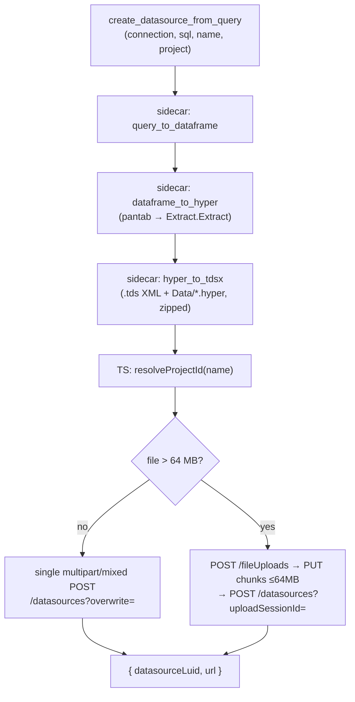

# Publish lifecycle

The full path from a query to a governed published datasource (and a starter workbook) on Cloud.

## Datasource: create → hyper → tdsx → publish

1. **Query → DataFrame.** The sidecar runs the SQL (Snowflake/Postgres) or reads a CSV, capped at
   `maxRows`.
2. **DataFrame → `.hyper`.** pantab writes the data to the conventional `Extract.Extract` table;
   Hyper column types are inferred from pandas dtypes.
3. **`.hyper` → `.tdsx`.** The extract's columns are read back to build a `.tds` (a `hyper`
   connection pointing at `Data/<file>.hyper`, a relation, and per-column metadata). The `.tds` and
   `.hyper` are zipped into a `.tdsx`.
4. **Publish.** The TS layer resolves the project name to a LUID and publishes the `.tdsx`.

## The chunked publish (> 64 MB)

Tableau requires large files to be uploaded in pieces:

1. `POST /sites/{site}/fileUploads` → `uploadSessionId`.
2. `PUT /sites/{site}/fileUploads/{id}` for each chunk (≤ 64 MB), as `multipart/mixed` with an
   (empty) `request_payload` part and a `tableau_file` part.
3. `POST /sites/{site}/datasources?uploadSessionId={id}&datasourceType=tdsx&overwrite=…` with the
   datasource XML metadata to finalize.

**Failure handling:** if any chunk `PUT` fails, the upload is abandoned and the error propagates —
the finalize POST is never sent, so there is no partial publish. Files at or below 64 MB (including
exactly 64 MB) take a single multipart request instead.

## Workbook: bind → twbx → publish

`create_starter_workbook` resolves the published datasource's server-assigned **contentUrl** (via
`GET /datasources/{id}`), then the sidecar generates a `.twb` that references it
(`class='sqlproxy'` + a `repository-location` keyed by contentUrl + site), with one worksheet per
sheet spec (Columns/Rows shelves, a `<mark>` class, and a `<datasource-dependencies>` block whose
field names match the request). The `.twb` is zipped into a `.twbx` and published.

> **Note:** hand-authored workbook XML is schema-sensitive. Bar/line/text marks are reliably
> generated and verified structurally in CI; full "renders in Tableau" validation is performed once
> against a live Developer Program site (see `ACCEPTANCE.md`).
